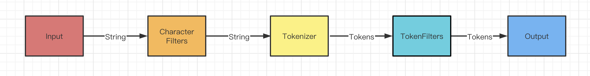
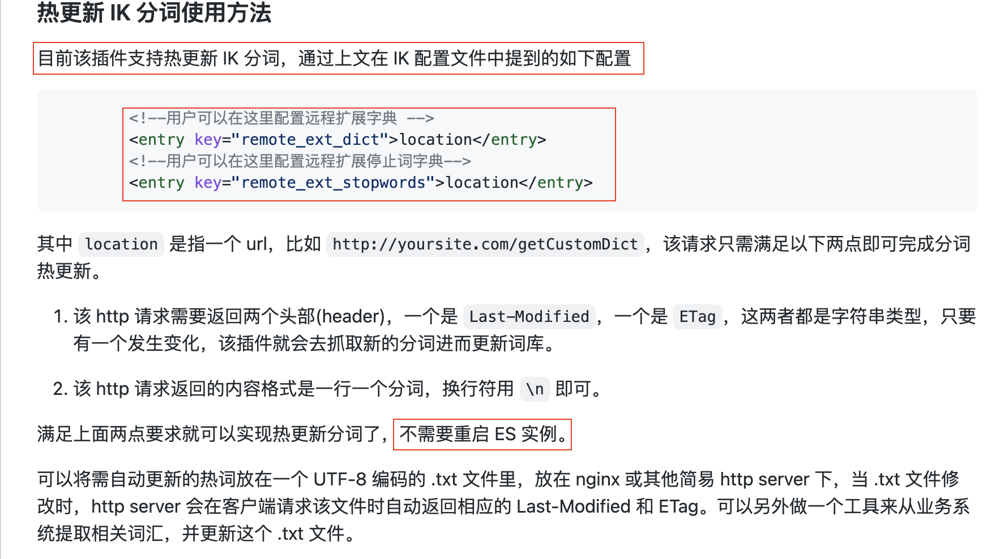

# 1. 什么是分词？
- 分词（Word segmentation）是将一串书面语言分成其组成词的问题。中文分词指的是使用计算机自动对中文文本进行词语的切分，即像英文那样使得中文句子中的词之间有空格以标识。中文分词被认为是中文自然语言处理中的一个最基本的环节。

# 2. Elasticsearch 分词模块

## 2.1 分词模块组成以及数据走向
- ElasticSearch 中处理 Text Analysis 的组件被称为 Analyzer。相应地，Analyzer 也由三部分组成，Character Filters，Tokenizers 和 Token Filters。具体数据流程如下。




+ 补充说明：我们去了解elastic search的分词模块的目的是为了在工作中解决实际的应用问题（3.1-3.4）

## 2.2 分词模块-CharacterFilters
+ **功能**：将一些字符在分词之前进行加工处理（可以是增加，可以是删除，可以是替换），比如我们Html中的一些标签。
+ **示例**：Elasticsearch自带的一些Filter：
    - [HTML Strip Character Filter](https://www.elastic.co/guide/en/elasticsearch/reference/current/analysis-htmlstrip-charfilter.html)：这个可以过滤以及转换一些特定的Html标签
    - [Mapping Character Filter](https://www.elastic.co/guide/en/elasticsearch/reference/current/analysis-mapping-charfilter.html)：这个可以通过配置字典映射，Replace特定的字符串
    - [Pattern Replace Character Filter](https://www.elastic.co/guide/en/elasticsearch/reference/current/analysis-pattern-replace-charfilter.html): 通过正则表达式，Replace特定的字符串

## 2.3 分词模块-Tokenizer
+ **功能**：对已经经过CharacterFilters处理过的文本进行分词处理,比如通过空格将一句话分成多个Tokens，得到多个tokens。比如通过标点符号进行分割，得到多个Tokens。比如通过已有的词组进行分割，得到多个Tokens。
    - 举例（中文）：Input: 中华人民共和国人民大会堂, Outout:[中华人民共和国、中华人民、中华、华人、人民共和国、人民、共和国、大会堂、大会、会堂]
    - 举例（英文）：Input: "Quick brown fox!" ,Output [Quick, brown, fox!]
+ **中文用的Tokenizer**
    - [https://github.com/medcl/elasticsearch-analysis-ik](https://github.com/medcl/elasticsearch-analysis-ik)
+ **Elasticsearch自带的一些Tokenizer**
    - [https://www.elastic.co/guide/en/elasticsearch/reference/current/analysis-tokenizers.html](https://www.elastic.co/guide/en/elasticsearch/reference/current/analysis-tokenizers.html)

## 2.4 分词模块-TokenFilters
- 功能：对已经分词后的Tokens，可以对Tokens进行修改 (比如小写化), 删除 (比如移除中文中的的，得，等词) 或者增加（比如增加一些同义词)
- 示例：
    - Length Tokenfilter:3.1.1 通过Token的长度进行过滤
    - Limit Count Token Filter: 限定一段文本生成的Token的上限
    - 相关文档：[https://www.elastic.co/guide/en/elasticsearch/reference/current/analysis-tokenfilters.html](https://www.elastic.co/guide/en/elasticsearch/reference/current/analysis-tokenfilters.html)

# 3. 业务相关的搜索优化
## 3.1 搜索粒度最小为词，而非字
+ **为什么需要将搜索结果展示的粒度最小为词，而非字？**
    - 因为单字一般情况下载关联度比较低，可能会推荐很多不相关的数据，从而让用户感觉搜索体验不好。
    - 举例：我搜索“南山区的“，我想搜索结果中，只展示命中“南山区”的数据，而不要展示命中“的”的数据

### 3.1.1 解决方案一：Token Length Filter
+ 在建立index的时候自己去配置一个Analyzer这里用到了Token Length Filter ，相关官方文档[https://www.elastic.co/guide/en/elasticsearch/reference/current/analysis-length-tokenfilter.html](https://www.elastic.co/guide/en/elasticsearch/reference/current/analysis-length-tokenfilter.html)

```go
curl -XPUT "localhost:9200/starry_sky-question-v1.0.2?pretty=true" -H 'content-type: application/json' --data '
{
    "settings": {
        "analysis": {
            "filter": {
                "len": {
                    "type": "length",
                    "min": 2
                }
            },
            "analyzer": {
                "ik_smart_filter_length_less_2": {
                    "tokenizer": "ik_smart",
                    "filter": [
                        "len"
                    ]
                }
            }
        },
        "number_of_shards": 3,
        "number_of_replicas": 1
    },
    "mappings": {
        "properties": {
            "id": {
                "type": "keyword"
            },
            "title": {
                "type": "completion",
                "analyzer": "ik_max_word",
                "search_analyzer": "ik_smart_filter_length_less_2"
            },
            "content": {
                "type": "completion",
                "analyzer": "ik_max_word",
                "search_analyzer": "ik_smart_filter_length_less_2"
            },
            "status": {
                "type": "keyword"
            }
        }
    }
}
'

```

### 3.1.2  解决方案二： Mapping Character Filter 过滤这些常用的单个词
+ **优点**：可以展示更多搜索结果，因为不会导致一些识别度很高的单词在搜索的时候失效，比如当我们搜索词里面有“饕”这个词的时候，他虽然被分成一个词，长度也小于二，但是其实这个词识别度很高
+ **官方文档**：https://www.elastic.co/guide/en/elasticsearch/reference/current/analysis-mapping-charfilter.html

## 3.2 搜索时展示同义词
+ **为什么搜索时需要展示同义词？**：比如搜索“B站“的时候，其实我们也可以展示"bilibili"，以及“哔哩哔哩”，这些相关的数据，因为他们的意义是一样的。
    - 问题：需要注意的是需要区分优先级，也就是说命中B站的，逻辑上应该排在前面
+ **同义词来源**
    - **自己的业务积累。**
    - **互联网开源词库，比如GitHub，比如搜狗的细胞词库。**
    - **自己爬取特定领域的词库（比如百度百科）。**
+ **详细配置步骤**
    - **第一步：elasticserach.yml** 最后一行添加：index.analysis.analyzer.default.type: ik
    - **第二步**：在elasticsearch/usr/share/elasticsearch/config/analysis-ik/目录下面，存放synonyms.txt，其中，synonyms.txt 编码格式为 utf-8。具体格式如下
    - 备注：
        * 哔哩哔哩 => bilibili : "=>"左边的词全部会被右边的词替换。
        * 哔哩哔哩,bilibili :使用","英文逗号分隔, 两个词是互等的,分词时会同时分成两个词进行索引或者检索,如"哔哩哔哩"会被分成"哔哩哔哩","bilibili"两个词分别建立索引或者去倒排索引检索

```go
哔哩哔哩,bilibili
百度云,百度云盘,百度网盘,蓝奏云
```

    - 第三步：新建立索引类型设置

```go
curl -XPUT "localhost:9200/test_index?pretty=true" -H 'content-type: application/json' --data '
{
    "settings": {
        "analysis": {
            "filter": {
                "synonym_filter": {
                    "type": "synonym",
                    "synonyms_path" : "analysis-ik/synonyms.txt"
                }
            },
            "analyzer": {
                "ik_smart_synonym_filter": {
                    "tokenizer": "ik_smart",
                    "filter": [
                        "synonym_filter"
                    ]
                }
            }
        },
        "number_of_shards": 3,
        "number_of_replicas": 1
    },
    "mappings": {
        "properties": {
            "id": {
                "type": "keyword"
            },
            "title": {
                "type": "completion",
                "analyzer": "ik_max_word",
                "search_analyzer": "ik_smart_synonym_filter"
            },
            "content": {
                "type": "completion",
                "analyzer": "ik_max_word",
                "search_analyzer": "ik_smart_synonym_filter"
            },
            "status": {
                "type": "keyword"
            }
        }
    }
}
'
```

    - 第四步：测试分词

```go
curl -X GET "localhost:9200/test_index/_analyze?pretty" -H 'Content-Type: application/json' -d'
{
  "analyzer": "ik_smart_synonym_filter",
  "text":     "哔哩哔哩"
}
'
# output
{
  "tokens" : [
    {
      "token" : "哔",
      "start_offset" : 0,
      "end_offset" : 1,
      "type" : "CN_CHAR",
      "position" : 0
    },
    {
      "token" : "bilibili",
      "start_offset" : 0,
      "end_offset" : 4,
      "type" : "SYNONYM",
      "position" : 0,
      "positionLength" : 4
    },
    {
      "token" : "哩",
      "start_offset" : 1,
      "end_offset" : 2,
      "type" : "CN_CHAR",
      "position" : 1
    },
    {
      "token" : "哔",
      "start_offset" : 2,
      "end_offset" : 3,
      "type" : "CN_CHAR",
      "position" : 2
    },
    {
      "token" : "哩",
      "start_offset" : 3,
      "end_offset" : 4,
      "type" : "CN_CHAR",
      "position" : 3
    }
  ]
}
```

## 3.3 搜索时展示同音词
+ **为什么搜索时需要展示同音词？**：中国大家基本都是有拼音打字的居多，然后有一些字音一样，但是字不一样，然后打拼音的时候就可能打错，所以这个时候，希望可以直接关联搜索到。比如刘德华-> 我搜成了刘德化
+ **详细配置步骤**：[https://github.com/medcl/elasticsearch-analysis-pinyin](https://github.com/medcl/elasticsearch-analysis-pinyin)
+ **效果示例**：

```go
GET /medcl/_analyze
{
  "text": ["刘德华"],
  "analyzer": "pinyin_analyzer"
}

// output
{
  "tokens" : [
    {
      "token" : "liu",
      "start_offset" : 0,
      "end_offset" : 1,
      "type" : "word",
      "position" : 0
    },
    {
      "token" : "de",
      "start_offset" : 1,
      "end_offset" : 2,
      "type" : "word",
      "position" : 1
    },
    {
      "token" : "hua",
      "start_offset" : 2,
      "end_offset" : 3,
      "type" : "word",
      "position" : 2
    },
    {
      "token" : "刘德华",
      "start_offset" : 0,
      "end_offset" : 3,
      "type" : "word",
      "position" : 3
    },
    {
      "token" : "ldh",
      "start_offset" : 0,
      "end_offset" : 3,
      "type" : "word",
      "position" : 4
    }
  ]
}
```

## 3.4 自定义分词以及热更新
+ **为什么需要自定义分词以及热更新？**
    - **自定义分词**：因为分词的词典往往更新频率不是特别高，以及词典更多的是一些生活常用词，或者各个专业中出现频率高的术语。但这其实可能并不能覆盖我们实际的应用场景。比如网络热词 "yyds"，比如计算机专业中的术语 "零拷贝"，比如3.2里面我们示例用的"哔哩哔哩"
    - **热更新**：之前Elasticsearch如果进行词典更新，是需要重启服务的，而重启服务意味着服务会出现不可用的可能。所以我们需要热更新，同时我们这里需要考虑是否去更新历史数据。
+ **配置在线分词词典：**


    - 文档：[https://github.com/medcl/elasticsearch-analysis-ik](https://github.com/medcl/elasticsearch-analysis-ik)
+ **触发更新后自动更新历史数据：**
    - [https://www.elastic.co/guide/en/elasticsearch/reference/current/docs-update-by-query.html](https://www.elastic.co/guide/en/elasticsearch/reference/current/docs-update-by-query.html)

# 4. 参考文档
+ [https://xiaoxiami.gitbook.io/elasticsearch/4ji-chu-bu-chong/ding-yi-zi-ji-defen-xi-566828-analyzer](https://xiaoxiami.gitbook.io/elasticsearch/4ji-chu-bu-chong/ding-yi-zi-ji-defen-xi-566828-analyzer)
+ [https://discuss.elastic.co/t/defining-custom-analyzers-globally/27826](https://discuss.elastic.co/t/defining-custom-analyzers-globally/27826)
+ [https://www.jianshu.com/p/914f102bc174](https://www.jianshu.com/p/914f102bc174)


**输出知识是我对费曼学习法的实践，希望看完这篇文章觉得收获的同学点个赞，这对我很重要，感谢。另外有任何疑问或者看文章发现有什么错误都可以直接留言，一般都会回复，多谢多谢。**


