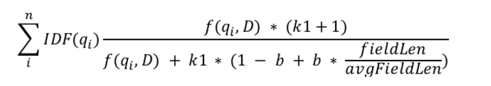
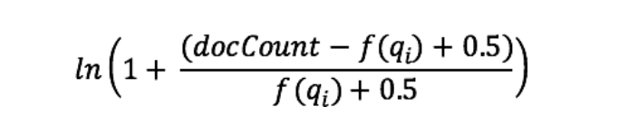
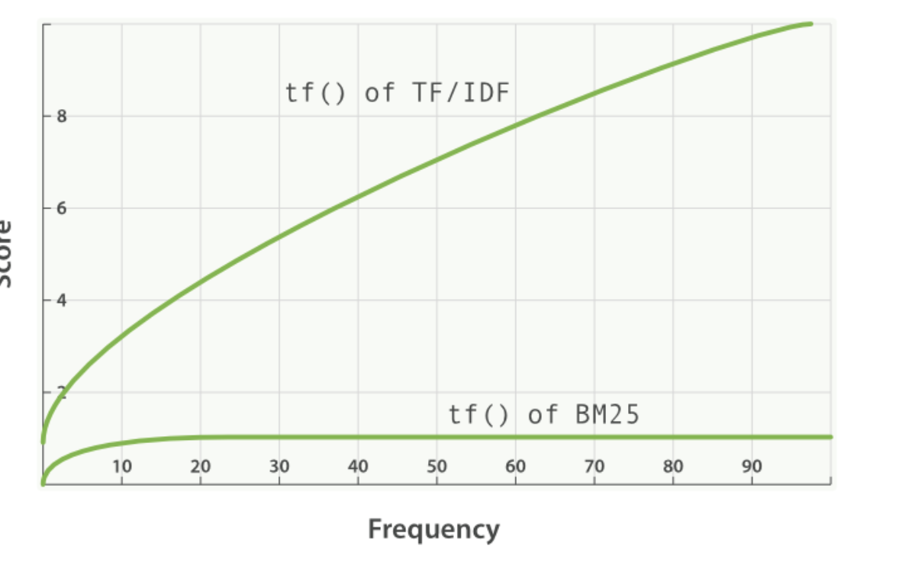

# 1. 为什么要了解 Elasticsearch 相关性分规则 ？ 
+ **我们做搜索的目的**，就是期望用户可以通过搜索找到他想要的内容。找到想要的内容可以分为两步。
    - 第一步：**我们需要检索到相关的内容**。
    - 第二步：我们需要把检索到相关的内容中**用户最想看到的展示在最前面**。
+ **如何达到检索到相关的内容？**
    - 首先我们需要了解 **Elasticsearch 的搜索语法**，比如：term (不分词搜索)，match（分词搜索），match_phrase（模糊搜索）。其次可以了解**ES的分词机制**，进而做到比如 同义词搜索 ，比如 同音词搜索，比如 自定义分词搜索等。
+ **如何达到相关的内容中用户最想看到的展示在最前面？**
    - 这个就**需要我们了解 ES 的评分规则**，然后就知道我们可以调整哪些配置参数，调整哪些查询参数，从而找到最适合我们自己业务场景的。

# 2. 什么样的搜索结果应该展示在前？
+ 我们先站在一个普通用户的角度去思考几个问题（选择题），假设现在我们想搜索一些关于远古巨兽的资料，我们打开了一个搜索网站，输入了搜索词：**麒麟和鲲鹏有什么区别？**


+ **问题一**：A：文章标题和内容命中“麒麟”的结果排在前面。B：文章标题和内容命中“有什么区别”的排在前面。
+ **问题二**：A：**文章标题**命中了“麒麟”的排前面 。 B：**文章内容**命中了“麒麟”排在前面。
+ **问题三**：A：**文章标题**命中了“麒麟”的排前面 。 B：**文章内容**命中了“麒麟”和“鲲鹏”排在前面。
+ **问题四：A：**文章标题和内容中出现2次“麒麟”的排前面。B：文章标题和内容中出现1次“麒麟”的排前面。
+ **问题五**：A：文章标题和内容中出现1次“麒麟”和1次“鲲鹏”。 B：文章标题和内容中出现10次“麒麟”。
+ **列出来这五个问题，我理解其实分别对应着 Elasticsearch 评分公式 BM25 中5个变量，也正是这5个变量以及他们的组合，让搜索结果的相关性得分（排序）更加符合我们的直觉。（问题答案在3.4）**

# 3. Elasticsearch score 公式解析
## 3.1 公式背景说明 
+ Elasticsearch 缺省的打分机制改成了[Okapi_BM25](https://en.wikipedia.org/wiki/Okapi_BM25)。BM25 的 BM 是缩写自 Best Match,它也是基于 TF/IDF 进化来的。

## 3.2 sharding 对于score的影响
- **我们给 Elasticsearch index 配置的分片数量，会影响分数的计算。**
    - 简单来说就是我们默认的计分规则是基于单个 sharding 的。比如当下有5个 sharding，然后总共10个文档分布在分布在这五个不同的 sharding 中（可能有一些 sharding 有3个文档，有一些有1个文档）。这个时候我们进行搜索，搜索结果落在两个 sharding，由于这两个 sharing 中的文档总数量不一致，导致类似的文档，但是各自的分数不一致。具体影响的解析可以参考 Elasticsearch 官方 blog 的说明：
    - 参考文档：[https://www.elastic.co/blog/practical-bm25-part-1-how-shards-affect-relevance-scoring-in-elasticsearch](https://www.elastic.co/blog/practical-bm25-part-1-how-shards-affect-relevance-scoring-in-elasticsearch)
    - **备注：下面如果没有特殊说明，所有的分数讨论都是基于单个sharding的情况下。**

## 3.3 具体公式以及拆解
+ 具体公式如下：（**大家看到先别慌，我们一步步拆这个公式，问题不大的**）



+ **1. qi** 是指我们输入的搜索词。
    - 举例：比如我们输入的搜索词是“Shane”，分词后，q0 是 “Shane”。我们输入的搜索词是 “Shane connelly”，通过空格分词后，搜索词分词成两个词q0=Shane, q1=connelly。**计算的时候将q0和q1依次代入后面的公式，然后将各自得到的分数进行相加，得到最后的结果。**
+ **2. IDF(g****i****) **是针对我们的搜索词，进行 **IDF(逆向文档频率) **计算,具体关于 TF/IDF 详细解释可以参考[维基百科-tf-idf](https://en.wikipedia.org/wiki/Tf%E2%80%93idf#Inverse_document_frequency), 我们这里只讨论在ES中我们Lucene/BM25用到的一部分公式，具体公式如以下截图
    - 
    - **docCount：**指的是当前 sharding 拥有的总的文档数量。
    - **f(qi)**：指的是当前 sharding 所有的文档中，包含了qi这个分词的文档数量。
        * 举例一：如果我们计算 IDF（"Shane"），已知条件是，目前 index 中只有一个sharding，里面总共有4个文档，然后4个文档都包含”Shane“这个词，那么计算公式以及结果如下
            + 
        * 举例二：如果我们计算IDF（”connelly“），已知条件是，目前 index 中只有一个sharding，里面总共有4个文档，然后其中有两个文档包含”connelly“这个词，那么计算公式以及结果如下
            + 
+ **3. fieldLen/avgFieldLen：这个字面意思是我们所搜索的字段长度，除以目前所有文档的平均长度。**
    - 假如我们搜索命中两个文档，其他条件相同的情况下，那么文档内容越短的那一个文档，分数会越高。就像我们日常使用搜索，如果文章标题命中了搜索词，会比文章内容命中了搜索词对我们来说更加重要。
    - 备注：**fieldLen/avgFieldLen **在 BM25 这个论文里面 Len 这个代表的字段的字符长度，不过**在 Elasticsearch 里面这个 len 代表的是字段被分词后词的数量**。
+ 4. **b **：控制 fieldLen/avgFieldLen 对于分数的影响。
    - **当 b 这个数值越大的时候，则** fieldLen/avgFieldLen对最终分数计算的影响也就越大。而当 b 这个参数为0的时候，fieldLen/avgFieldLen 这个参数将不会对最终的分数产生影响。备注： [elasticsearch默认b=0.75](https://www.elastic.co/guide/en/elasticsearch/reference/current/index-modules-similarity.html)。
+ 5. **k1** 和 **f(qi,D)：**
    - **f(qi,D) : **计算一个词，在一个文档中出现的次数, 一个词在同一个文档中，出现的次数越多，那么得分越高。
    - **k1 : ** 控制 f(qi,D) 对分数影响。**目前elasticsearch默认配置的 K1 的值为1.2。**这里说一下为什么需要有这个k1。
        * 具体来说就涉及到一个概念 [term-frequency saturation](https://www.elastic.co/guide/en/elasticsearch/guide/master/pluggable-similarites.html#bm25-saturation)，比如两个文档，一个文档中出现了搜索词1次，一个出现了2个，那他们的相关性得分可以是接近1:2，但是一个词出现1次和20词，他们的得分比例不应该是1:20。我们这里讨论的公式通过k1来解决这个不应该。
        * 这里可以看 **TF/IDF（没有K1） 和 BM25（有K1）的对比图。**
    - 

## 3.4 回顾搜索结果展示问题
+ 公式解析完以后，我们再回看一下一开始提到的 5 个问题，看看答案以及导致这个答案的相关参数。
+ **问题一**：A：文章标题和内容命中“麒麟”的结果排在前面。B：文章标题和内容命中“有什么区别”的排在前面。	
    - 答案：A更加符合直觉。
    - 对应公式参数：**IDF(g****i****)**
+ **问题二**：A：**文章标题**命中了“麒麟”的排前面 。 B：**文章内容**命中了“麒麟”排在前面。
    - 答案：A更加复合直觉。
    - 对应公式参数：**fieldLen/avgFieldLen**
+ **问题三**：A：**文章标题**命中了“麒麟”的排前面 。 B：**文章内容**命中了“麒麟”和“鲲鹏”排在前面。
    - 答案：B更加复合直觉。
    - 对应公式参数：**b**
+ **问题四：A：**文章标题和内容中出现2次“麒麟”的排前面。B：文章标题和内容中出现1次“麒麟”的排前面。
    - 答案：A更加复合直觉。
    - 对应公式参数：**b**
+ **问题五**：A：文章标题和内容中出现1次“麒麟”和1次“鲲鹏”。 B：文章标题和内容中出现10次“麒麟”。
    - 答案：A更加复合直觉。
    - 对应公式参数：**k1**

# 4. 通过实践进一步理解公式
## 4.1 创建index和新增数据
+ 1. 我们建立一个三个 index，同时将 sharding 的数量设置为1，这样可以避免由于分片带来的误差。我们构建三个 index，分别配置
    - people index 中k1=0，b =0.5 
    - people2 index 中k1=10，b =0
    - people3 index 中k1=5，b =1

```shell
curl -XPUT "localhost:9200/people?pretty=true" -H 'content-type: application/json' --data '
{
    "settings": {
        "number_of_shards": 1,
        "index": {
            "similarity": {
                "default": {
                    "type": "BM25",
                    "b": 0.5,
                    "k1": 0
                }
            }
        }
    }
}
'

curl -XPUT "localhost:9200/people2?pretty=true" -H 'content-type: application/json' --data '
{
    "settings": {
        "number_of_shards": 1,
        "index": {
            "similarity": {
                "default": {
                    "type": "BM25",
                    "b": 0,
                    "k1": 10
                }
            }
        }
    }
}
'

curl -XPUT "localhost:9200/people3?pretty=true" -H 'content-type: application/json' --data '
{
  "settings": {
    "number_of_shards": 1,
    "index" : {
        "similarity" : {
          "default" : {
            "type" : "BM25",
            "b": 1,
            "k1": 5
          }
        }
    }
  }
}
'
```

+ 2. 新增文档到三个 index 里面

```go
# 批量插入数据
curl -XPOST "localhost:9200/people/_bulk?pretty=true" -H 'content-type: application/json' --data '
{ "index": { "_id": "1" } }
{ "title": "Shane" }
{ "index": { "_id": "2" } }
{ "title": "Shane C" }
{ "index": { "_id": "3" } }
{ "title": "Shane P Connelly" }
{ "index": { "_id": "4" } }
{ "title": "Shane Connelly" }
{ "index": { "_id": "5" } }
{ "title": "Shane Shane Connelly Connelly" }
{ "index": { "_id": "6" } }
{ "title": "Shane Shane Shane Connelly Connelly Connelly" }
'

# 批量插入数据
curl -XPOST "localhost:9200/people2/_bulk?pretty=true" -H 'content-type: application/json' --data '
{ "index": { "_id": "1" } }
{ "title": "Shane" }
{ "index": { "_id": "2" } }
{ "title": "Shane C" }
{ "index": { "_id": "3" } }
{ "title": "Shane P Connelly" }
{ "index": { "_id": "4" } }
{ "title": "Shane Connelly" }
{ "index": { "_id": "5" } }
{ "title": "Shane Shane Connelly Connelly" }
{ "index": { "_id": "6" } }
{ "title": "Shane Shane Shane Connelly Connelly Connelly" }
'

# 批量插入数据
curl -XPOST "localhost:9200/people3/_bulk?pretty=true" -H 'content-type: application/json' --data '
{ "index": { "_id": "1" } }
{ "title": "Shane" }
{ "index": { "_id": "2" } }
{ "title": "Shane C" }
{ "index": { "_id": "3" } }
{ "title": "Shane P Connelly" }
{ "index": { "_id": "4" } }
{ "title": "Shane Connelly" }
{ "index": { "_id": "5" } }
{ "title": "Shane Shane Connelly Connelly" }
{ "index": { "_id": "6" } }
{ "title": "Shane Shane Shane Connelly Connelly Connelly" }
'
```


## 4.2  第一次检索（参数b的影响）
+ 备注：people index 中 k1=0，b =0.5

```go
curl -XPOST "localhost:9200/people/_doc/_search?pretty=true" -H 'content-type: application/json' --data '
{
  "query": {
    "match": {
      "title": "shane"
    }
  }
}
'
// 所有检索到的数据score无差别，所以就不展示了
```

+ 这里我们可以看到搜索检索出来的文档的分数都是0.074107975，这是因为我们将k1设置为了0，所以只有IDF这里进行了计算分数。

## 4.3 第二次检索（参数k1的影响）
+ 备注：people2 index 中 k1=10，b=0

```go
curl -XPOST "localhost:9200/people2/_doc/_search?pretty=true" -H 'content-type: application/json' --data '
{
  "query": {
    "match": {
      "title": "shane"
    }
  }
}
'
{
  "took" : 2,
  "timed_out" : false,
  "_shards" : {
    "total" : 1,
    "successful" : 1,
    "skipped" : 0,
    "failed" : 0
  },
  "hits" : {
    "total" : {
      "value" : 6,
      "relation" : "eq"
    },
    "max_score" : 0.18812019,
    "hits" : [
      {
        "_index" : "people2",
        "_type" : "_doc",
        "_id" : "6",
        "_score" : 0.18812019,
        "_source" : {
          "title" : "Shane Shane Shane Connelly Connelly Connelly"
        }
      },
      {
        "_index" : "people2",
        "_type" : "_doc",
        "_id" : "5",
        "_score" : 0.13586462,
        "_source" : {
          "title" : "Shane Shane Connelly Connelly"
        }
      },
      {
        "_index" : "people2",
        "_type" : "_doc",
        "_id" : "1",
        "_score" : 0.074108005,
        "_source" : {
          "title" : "Shane"
        }
      },
      {
        "_index" : "people2",
        "_type" : "_doc",
        "_id" : "2",
        "_score" : 0.074108005,
        "_source" : {
          "title" : "Shane C"
        }
      },
      {
        "_index" : "people2",
        "_type" : "_doc",
        "_id" : "3",
        "_score" : 0.074108005,
        "_source" : {
          "title" : "Shane P Connelly"
        }
      },
      {
        "_index" : "people2",
        "_type" : "_doc",
        "_id" : "4",
        "_score" : 0.074108005,
        "_source" : {
          "title" : "Shane Connelly"
        }
      }
    ]
  }
}
```

+ 第一件事：这里可以看到文档1，2，,3，4都有着一样的分数0.074108005（**因为我们把 b 设置为了0**），而文档5有更高的分数 (0.13586462) 因为f(“shane”,D5) = 2 ，文档6则更高(0.18812019) 因为 f(“shane”,D6) = 3。
+ 第二件事：对于命中 Shane ，出现次数越多的时候，他们的分数并不是线性上升的。比如
    - 没有命中搜索词时是0分，当 Shane 出现一次的时候，他们的分数是0.074108005
    - 当 Shane 出现两次的时候，分数和出现一次的差值是，0.13586462 - 0.074108005 = 0.061756645
    - 当 Shane 出现三次的时候，分数和出现两次的差值是， 0.18812019 - 0.13586462 = 0.05225557
    - 这里 0.074108005 非常接近0.061756645，也非常接近0.05225557，但是这个接近已经是明显在减少了。这里看起来接近线性是因为我们把 k1 设置的很大（默认是1.2，我们这里设置成了10）

## 4.4 第三次检索（正常搜索逻辑）
+ 备注：people2 index 中 k1=5，b=1

```go
➜  ~ curl -XPOST "localhost:9200/people3/_doc/_search?pretty=true" -H 'content-type: application/json' --data '
{
  "query": {
    "match": {
      "title": "shane"
    }
  }
}
'
{
  "took" : 26,
  "timed_out" : false,
  "_shards" : {
    "total" : 1,
    "successful" : 1,
    "skipped" : 0,
    "failed" : 0
  },
  "hits" : {
    "total" : {
      "value" : 6,
      "relation" : "eq"
    },
    "max_score" : 0.16674292,
    "hits" : [
      {
        "_index" : "people3",
        "_type" : "_doc",
        "_id" : "1",
        "_score" : 0.16674292,
        "_source" : {
          "title" : "Shane"
        }
      },
      {
        "_index" : "people3",
        "_type" : "_doc",
        "_id" : "2",
        "_score" : 0.102611035,
        "_source" : {
          "title" : "Shane C"
        }
      },
      {
        "_index" : "people3",
        "_type" : "_doc",
        "_id" : "4",
        "_score" : 0.102611035,
        "_source" : {
          "title" : "Shane Connelly"
        }
      },
      {
        "_index" : "people3",
        "_type" : "_doc",
        "_id" : "5",
        "_score" : 0.102611035,
        "_source" : {
          "title" : "Shane Shane Connelly Connelly"
        }
      },
      {
        "_index" : "people3",
        "_type" : "_doc",
        "_id" : "6",
        "_score" : 0.102611035,
        "_source" : {
          "title" : "Shane Shane Shane Connelly Connelly Connelly"
        }
      },
      {
        "_index" : "people3",
        "_type" : "_doc",
        "_id" : "3",
        "_score" : 0.074107975,
        "_source" : {
          "title" : "Shane P Connelly"
        }
      }
    ]
  }
}
```

+ **第一件事**：影响分数的结果有两个，第一个是匹配到的文档长度（ terms 的数量）第二个是 Shane 在文档中出现的次数。具体可以通过公式进行化简得来。
+ **第二件事**：我们可以看到不管是 people2 还是 people3，第一名分数和最后一名分数都是相差很大的。主要原因就是因为K1值较大。我们可以尝试进行**第四次检索，把K1的值调小（b=0,K1=0.01）**，这里会发现，不同的文档之间的分数相差会变得很小。数据如下：
    - 1. 没有命中搜索词时是0分，当Shane出现一次的时候，他们的分数是 0.074107975
    - 2. 当 Shane 出现两次的时候，分数和出现一次的差值是，0.074476674 - 0.074107975 = 0.000368699
    - 3. 当 Shane 出现三次的时候，分数和出现两次的差值是，0.07460038 - 0.074476674 = 0.000123706
    - **所以可以知道，K1 这个值控制了搜索词出现次数对于分数的影响大小，当K1值越大，则搜索词出现次数对分数影响越大，反之亦然。**

# 5. 参考
+ [https://cloud.tencent.com/developer/article/1600163](https://cloud.tencent.com/developer/article/1600163)
+ [https://www.compose.com/articles/how-scoring-works-in-elasticsearch/](https://www.compose.com/articles/how-scoring-works-in-elasticsearch/)
+ [https://www.elastic.co/guide/cn/elasticsearch/guide/current/scoring-theory.html#tf](https://www.elastic.co/guide/cn/elasticsearch/guide/current/scoring-theory.html#tf)
+ elasticsearch官方blog
    - [https://www.elastic.co/blog/practical-bm25-part-1-how-shards-affect-relevance-scoring-in-elasticsearch](https://www.elastic.co/blog/practical-bm25-part-1-how-shards-affect-relevance-scoring-in-elasticsearch)
    - [https://www.elastic.co/blog/practical-bm25-part-2-the-bm25-algorithm-and-its-variables](https://www.elastic.co/blog/practical-bm25-part-2-the-bm25-algorithm-and-its-variables)
+ [https://www.elastic.co/guide/en/elasticsearch/guide/master/pluggable-similarites.html#bm25-saturation](https://www.elastic.co/guide/en/elasticsearch/guide/master/pluggable-similarites.html#bm25-saturation)
+ [https://www.jianshu.com/p/70d1c3045c11](https://www.jianshu.com/p/70d1c3045c11)

