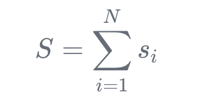
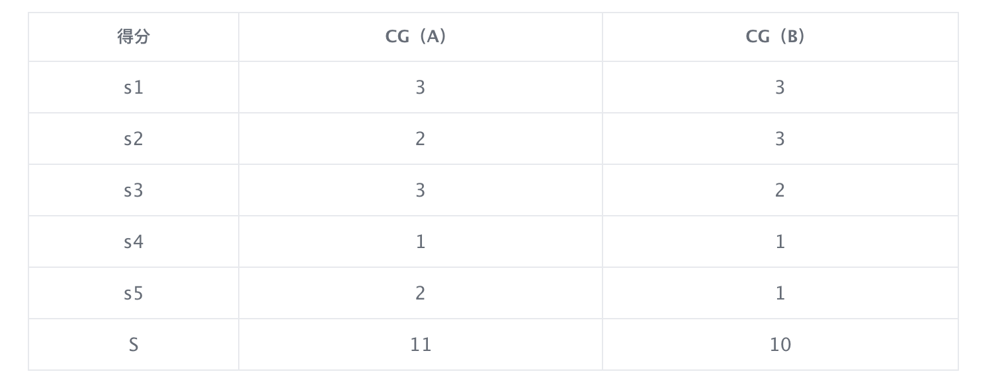
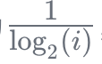
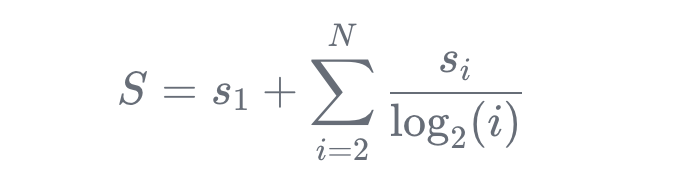
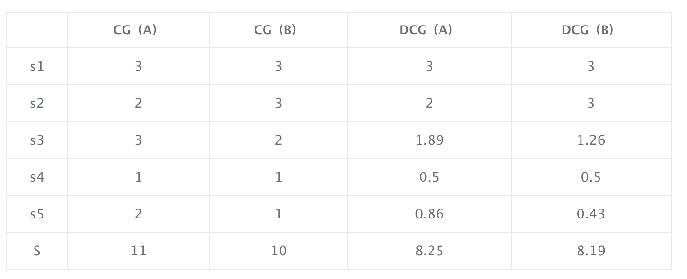
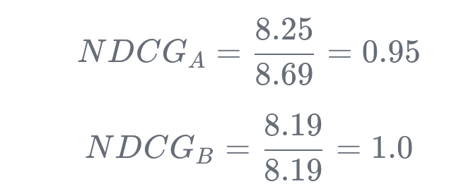

这篇文章基本都是搬运的这个博主（[http://zhaoxi-sight.com/](http://zhaoxi-sight.com/)）写的，相当于转载了，就稍微改动了一下。大家也可以直接看原文。

# 1. 要解决的问题和NDCG的定义
我前面写了几篇文章，分别是介绍ES分词模块，相关性评分算法BM25，以及自定义的function_score，这些所有的目的都是为了让我们做出体验更好的搜索模块。

而体验更好分为两个点，第一点是性能，这个我们可以直观感受到“卡”和不卡，可以用接口多少秒返回数据来进行量化，第二点就是搜索结果是否是用户想要的（不等于搜的准），比如我们搜索“liudehua”，那么可能是我们输入法错误，这个时候应该给我展示“刘德华”相关的搜索才是我们想要的。

这个时候大家就会发现性能好量化，反过来***搜索结果是否是用户想要***这个量化起来会感觉有点棘手，也就是基于这个背景，我要分享的一个算法是NDCG，NDCG一般用于评价搜索结果列表的好坏，NDCG的全称是Normalized Discounted cumulative gain，意思为归一化折损累积收益。

# 2. 演化过程：CG->DCG->NDCG 
基础场景：比如当搜索系统返回了5个结果，我们该如何度量其好坏呢？NDCG的做法是，先对每个结果进行打分。比如我们对搜索结果的好坏有如下的评价：3（good），2（fair），1（bad）。  

假设我们搜索一个关键词，然后有A同事和B同事分别对结果进行打分，A给两次搜索结果评分依次是`{3，2，3，1，2}`。而B给两次搜索结果评分：`{3，3，2，1，1}`。

然后基于以上数据，依次对以上数据进行CG->DCG->NDCG 。

## 2.1 累计收益：CG（Cumulative Gain）
****假设结果列表A包含了N个item，第i个item的得分是si，那么总得分就是：

因此，A、B每个位置的得分如下：

## 2.2 折损累计收益：DCG（Discounted Cumulative Gain）
**CG的问题很明显，没有考虑顺序**。A：`{3，2，3，1，2}`和B：`{3，3，2，1，1}`。的CG是一样的，但是对于搜索结果而言，位置越靠前，用户越容易触达，得分越高越好。所以给每个位置设置了一个折损因子，位置越靠后，收益折损的越厉害。  
 一般折损因子设置为，i就是结果的位置。但是如果i=1，分母是0，含义其实是不折损，所以单独提取出来，因此总得分就是：

因此，A、B每个位置的得分如下：

## 2.3 归一化折损累计收益：NDCG（Normalize Discounted Cumulative Gain）
**DCG的问题也很明显，没有上界，受个数影响**。不同的query下，搜索结果返回的个数也不同，理论上返回的个数越多，计算DCG是越占便宜的。所以为了全局可比，需要做一次归一化。而归一化因子就是IDCG（ideal Discounted Cumulative Gain）。

### 2.3.1 IDCG
**IDCG 就是当前结果在最理想情况下的 DCG**。比如结果A`{3，2，3，1，2}`的理想结果应该是`{3，3，2，2，1}`。所以A的 IDCG 就是`{3，3，2，2，1}`的DCG，即：

`IDCG_A = 3+3+1.26+1+0.43=8.69`

同理B**{3，3，2，1，1}**的理想结果应该是`{3，3，2，1，1}`。所以B的IDCG就是`{3，3，2，1，1}`的DCG，即：

`IDCG_B = 3+3+1.26+0.5+0.43=8.19`

### 2.3.2 NDCG
**NDCG就是当前结果的DCG用IDCG进行归一化，用于表示当前结果接近最理想的结果的程度。**

因此：

