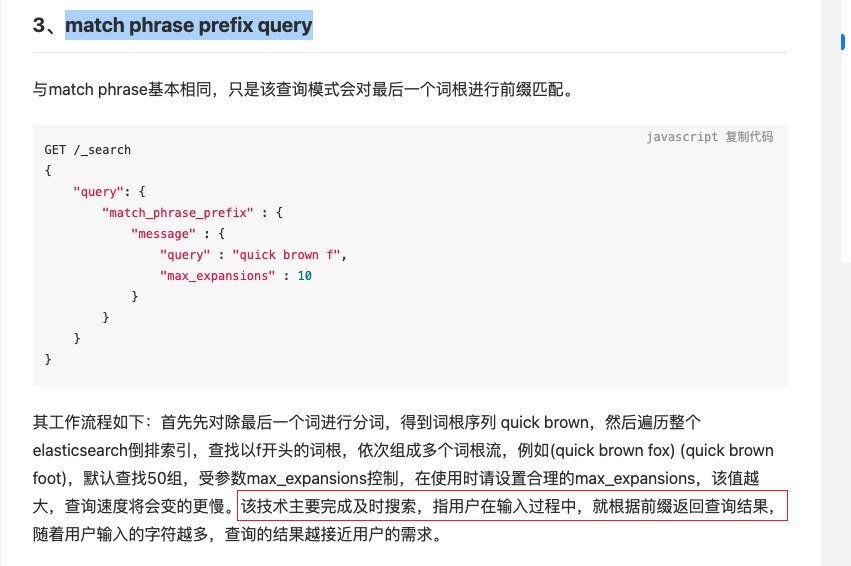

# 1. what
举例，我们使用Google的时候，Google会提示我们


+ 可以看到这里Google自动提示分为两种
    - 第一种：我之前有搜索过的历史记录
    - 第二种：根据目前各种词的出现频率进行了展示（不排除里面有我被打上的tag进行了运算）


# 2. why
+ 为什么要怎么做？
    - 可以节省用户输入时间，用户体验++
+ 为什么Google可以做到这样？
    - 有记录我们的搜索历史记录
    - 有记录其他用Google搜索引擎的人的搜索记录，进行综合分析
    - 有针对性的进行了数据存储优化，搜索算法优化，使得可以接近即时的自动提示

# 3. how
## 3.1 基础分析
+ 如果普通的公司做类似的自动补齐，我们可以怎么去做？
    - 第一种：前端来做，跨域，借用[第三方的自动提示API](https://www.iaspnetcore.com/blog/blogpost/5a8efc68f5eba4276034179d)
    - 第二种：后端来做，利用业务数据库中的数据，提供实时提示
+ **第一种**
    - 目前不考虑第一种，因为是用于搜索。因为提示和业务数据无关，而是来自第三方。所以会出现，用户输入A，我们自动补齐ABC这个关键词，但实际上啥也搜不出来
+ **第二种**：
    - mysql：直接排除，因为感觉用mysql做这个，数据量少，那做了没意思，数据量多，mysql性能也跟不上
    - redis：可以通过redis的zset数据结构来进行提示 -> 3.1
    - elasticsearch：可以通过elasticsearch来进行提示 - > 3.2


## 3.1 用redis实现
+ 数据结构：用 zset 进行存储，member为热词，score统一为0，这样的话，默认排序就会按照member的顺序进行排序
+ 插入数据如下


+ 现在触发一次自动补齐，后端需要做的操作
    - 1. 接受到用户输入的 关键词 ，查看是否是否存在与此 zset 中
    - 2. 如果关键词存在，则直接获取下标，如果不存在，则插入后，获取到下标
    - 3. 根据所获得的下标，然后进行获取此下标后面N个关键词
    - 4. 取出数据展示如下
        * 
+ 优点：实现简单，同时redis可以提供较高的性能
+ 缺点：
    1. 没有利用到业务数据库中的词频等数据
    2. 算法太过于简单粗暴，按道理可以通过树或者字符串匹配算法来提高查找效率和存储效率
    3. 自动补齐可能补齐不相关的数据，需要特殊处理
    4. 不支持热点数据，需要另外一个zset进行记录，然后对取出来的数据进行取交集
    5. 不支持纠错功能（因为不是存储的拼音）

## 3.2 用elasticsearch实现
uggesters API 来实现这个功能

1. Term Suggester（纠错补全，输入错误的情况下补全正确的单词）
    1. 这个建议是基于编辑距离，基于已经在数据库中的数据进行分词，然后分割出来术语
    2. 所有出来的结果有两种排序方式
        1. 第一种（score）：首先按照分数，然后是文档出现的频率，然后是被搜索词本身
        2. 第二种（frequency）： 首先按照文档出现的频率，然后是分数，然后是术语本身
2. **Phrase Suggester**（自动补全短语，输入一个单词补全整个短语）
    1. 这个建议是基于编辑距离，基于已经在数据库中的数据进行分词，然后分割出来术语，但是会根据字符串之间的距离再次提示短语
    2. 同时具有纠错功能
3. **Completion Suggester(**完成补全单词，输出如前半部分，补全整个单词）
4. **Context Suggester（上下文补全，可以基于Completion Suggester的基础上做）**
    1. 可以在插入数据的时候，数据的字段打上特定的标签
    2. 然后做sugget搜索的时候，加一个搜索条件，这样的话，就会从特点的数据中进行搜索
    3. 标签支持两种：category 和 geo
        1. category：就一个或者多个字符串进行标记，比如对于食物，我们可以给一个类型为category 的标签，字段名是place_type，然后字段值是resturant，如果命中了对应的一个或者多个place_type，则可以提升分数
        2. geo： 地理上下文可以在索引时将一个或多个地理点与文档字段相关联。在查询时，如果建议在特定地理位置的一定距离内，则可以过滤和提升分数
+ **我们前期选择 Completion Suggester 因为这个性能最好，他将数据保存在内存中的有限状态转移机中（FST）**
    - 后期如果需要优化，可以结合 Term Suggester ，Phrase Suggester， Context Suggester进行优化

### 3.2.1 建立对应的index（completion 实现）
```sql
curl -XPUT "localhost:9200/test_index?pretty=true" -H 'content-type: application/json' --data '
{
    "settings": {
        "number_of_shards": 1
    },
    "mappings": {
        "properties": {
            "id": {
                "type": "keyword"
            },
            "title": {
                "type": "completion",
                "analyzer": "ik_max_word",
                "search_analyzer": "ik_smart"
            },
            "content": {
                "type": "completion",
                "analyzer": "ik_max_word",
                "search_analyzer": "ik_smart"
            },
            "status": {
                "type": "keyword"
            }
        }
    }
}
'

curl -XPOST "localhost:9200/test_index/_doc/?pretty=true" -H 'content-type: application/json' --data '
{
    "id": 1,
    "title": "春节碰到自己的前男友怎么办？",
    "content": "如题",
    "status": "1"
}
'
curl -XPOST "localhost:9200/test_index/_doc/?pretty=true" -H 'content-type: application/json' --data '
{
    "id": 1,
    "title": "春节碰到自己的前女友怎么办？",
    "content": "如题",
    "status": "1"
}
'
curl -XPOST "localhost:9200/test_index/_doc/?pretty=true" -H 'content-type: application/json' --data '
{
    "id": 1,
    "title": "春节碰到自己的老师怎么办？",
    "content": "如题",
    "status": "1"
}
'
curl -XPOST "localhost:9200/test_index/_doc/?pretty=true" -H 'content-type: application/json' --data '
{
    "id": 1,
    "title": "春节碰到自己的老师怎么办？我应该打招呼吗？",
    "content": "如题",
    "status": "1"
}
'


```


### 3.2.2 进行相应的查询
+ 最简单的查询
    - skip_duplicates 跳过返回的重复数据

```sql
curl -XPOST "localhost:9200/test_index/_doc/_search?pretty=true" -H 'content-type: application/json' --data '
{
	"suggest": {
		"suggest_1": {
			"text": "春节碰",
			"completion": {
				"field": "title",
        "skip_duplicates": true
			}
		}
	}
}
'

## response

{
  "took" : 2,
  "timed_out" : false,
  "_shards" : {
    "total" : 1,
    "successful" : 1,
    "skipped" : 0,
    "failed" : 0
  },
  "hits" : {
    "total" : {
      "value" : 0,
      "relation" : "eq"
    },
    "max_score" : null,
    "hits" : [ ]
  },
  "suggest" : {
    "suggest_1" : [
      {
        "text" : "春节碰",
        "offset" : 0,
        "length" : 3,
        "options" : [
          {
            "text" : "春节碰到自己的前女友怎么办？",
            "_index" : "test_index",
            "_type" : "_doc",
            "_id" : "eOZ-bX8BVW9cjfXV7UG_",
            "_score" : 1.0,
            "_source" : {
              "id" : 1,
              "title" : "春节碰到自己的前女友怎么办？",
              "content" : "如题",
              "status" : "1"
            }
          },
          {
            "text" : "春节碰到自己的前男友怎么办？",
            "_index" : "test_index",
            "_type" : "_doc",
            "_id" : "d-Z-bX8BVW9cjfXV7UGS",
            "_score" : 1.0,
            "_source" : {
              "id" : 1,
              "title" : "春节碰到自己的前男友怎么办？",
              "content" : "如题",
              "status" : "1"
            }
          },
          {
            "text" : "春节碰到自己的老师怎么办？",
            "_index" : "test_index",
            "_type" : "_doc",
            "_id" : "eeZ-bX8BVW9cjfXV7UHr",
            "_score" : 1.0,
            "_source" : {
              "id" : 1,
              "title" : "春节碰到自己的老师怎么办？",
              "content" : "如题",
              "status" : "1"
            }
          },
          {
            "text" : "春节碰到自己的老师怎么办？我应该打招呼吗？",
            "_index" : "test_index",
            "_type" : "_doc",
            "_id" : "euZ-bX8BVW9cjfXV7kEg",
            "_score" : 1.0,
            "_source" : {
              "id" : 1,
              "title" : "春节碰到自己的老师怎么办？我应该打招呼吗？",
              "content" : "如题",
              "status" : "1"
            }
          }
        ]
      }
    ]
  }
}

```


### 3.3.2  match phrase prefix query 实现


# 4. 参考链接
+ 自动提示API集合：[https://www.iaspnetcore.com/blog/blogpost/5a8efc68f5eba4276034179d](https://www.iaspnetcore.com/blog/blogpost/5a8efc68f5eba4276034179d)
+ 自动补齐：[https://www.6aiq.com/article/1599611620992](https://www.6aiq.com/article/1599611620992)
+ elasticsearch 7.1 官方支持搜索文档：[https://www.elastic.co/guide/en/elasticsearch/reference/7.17/search-suggesters.html](https://www.elastic.co/guide/en/elasticsearch/reference/7.17/search-suggesters.html)
+ [https://www.cnblogs.com/wangzhuxing/p/9574630.html](https://www.cnblogs.com/wangzhuxing/p/9574630.html)


