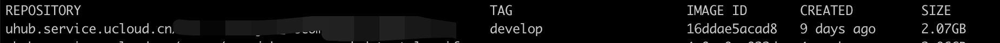
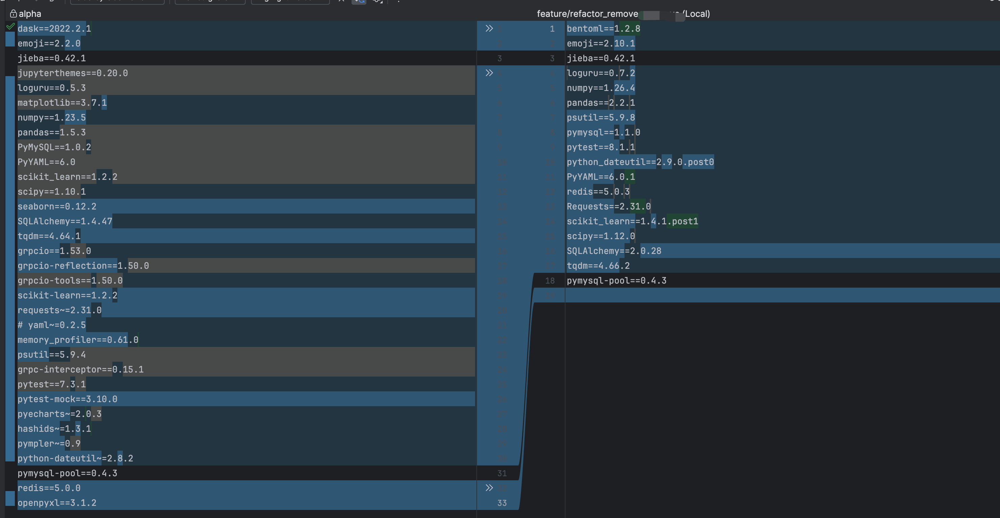
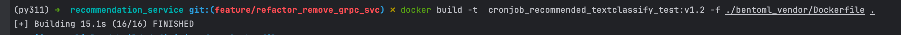
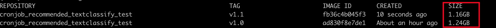
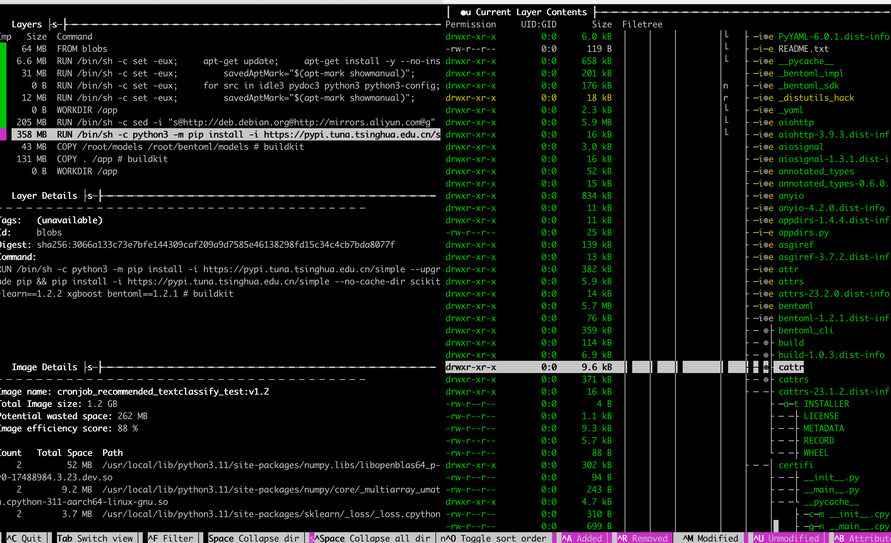
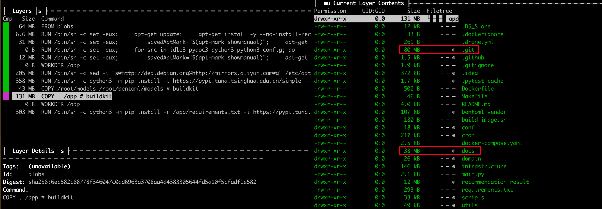
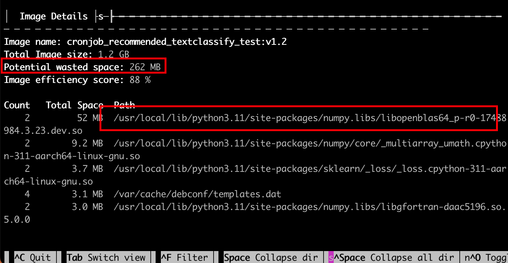
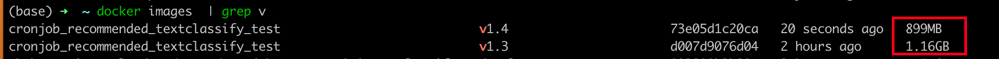

背景是有一个python项目，最近几次走CI的时候，发现耗时特别长（一部分是镜像很大push很慢，一部分是因为下载依赖有点慢），所以想办法解决一下。

 

# 项目基础情况
+ 先看下现在的镜像大小是多大？
    - **2.07GB**




+ 镜像里面有哪些东西

```yaml
ARG MODEL_TAG=develop
ARG IMAGE_TAG=202402051048

FROM uhub.service.ucloud.cn*/base_recommend_model:${MODEL_TAG} as store

# 由于 CP 命令不支持筛选，所以先在这个阶段筛选到临时目录
RUN mkdir /root/models && cp -r /root/bentoml/models/tag* /root/models

FROM uhub.service.ucloud.cn/unnoo/base_recommend_python:${IMAGE_TAG}

ENV TZ=Asia/Shanghai

COPY --from=store /root/models /root/bentoml/models

COPY . /app

WORKDIR /app

RUN ln -snf /usr/share/zoneinfo/$TZ /etc/localtime && \
echo $TZ > /etc/timezone && \
python3 -m pip install -r /app/requirements.txt

CMD ["python3"]
```

    - 这里有用到一个其他仓库提供的模型镜像（base_recommend_model），复制了里面的模型文件
    - 这里有用到一个基础的python镜像（base_recommend_python

# 移除python项目中的无用依赖
结论：效果显著的从2.07GB减少到了1.24GB


移除过程：

1，直接找到已经弃用的代码，直接把相关文件/相关的函数/相关的import进行删除

2，pip install pipreqs

3，移除主目录下的requirements.txt，然后pipreqs ./ 重新自动寻找依赖后生成一份requirements.txt

4，移除所有本地已经安装的包：pip freeze | xargs pip uninstall -y

5，重新下载依赖：pip install -r requirements.txt

6，尝试运行项目，看是否会报错（因为有时候pipreqs自动分析的包有可能下载错误，会导致导包错误）

7，最后项目可以正常运行后，对比一下requirements.txt，从原来依赖的33个包变成了18个



# 优化构建过程（目标镜像）
+ 在原来的dockerfile中调整一条命令（pip install的时候增加--no-cache-dir）

```yaml
python3 -m pip install -r /app/requirements.txt

改为

python3 -m pip install --no-cache-dir -r /app/requirements.txt -i https://pypi.tuna.tsinghua.edu.cn/simple/
```


# 调整github action 缓存pip install
除开上面减小镜像大小，还可以想办法对GitHub action进行调整，起到一个加速作用

**重点是在**： --mount=type=cache,target=/root/.cache/pip

这里这条命令相当于把缓存放到了宿主机可以起到两个作用：第一个是不用每次都去下载，第二个是不会把缓存存储到镜像


加上这一句以后，在同一台机器上构建的时候，就会使用到缓存进行加速构建

```yaml
RUN --mount=type=cache,target=/root/.cache/pip \
    python3 -m pip install -r /app/requirements.txt -i https://pypi.tuna.tsinghua.edu.cn/simple/
```

这是原来的docker file构建的速度（50S）


这是加上了缓存以后的构建速度（16S）




备注：上面测试的时候，跑之前都对requirements.txt稍微进行了修改，避免完全一样直接走缓存。

同时这里因为缓存挂载，所以镜像没有打包pip的缓存，同时内存占用的1.24到了1.16



# 用dive工具分析images
下载dive：GitHub地址：[https://github.com/wagoodman/dive](https://github.com/wagoodman/dive)

```yaml
brew install dive
```

找到镜像，然后分析镜像

```yaml
# 列出所有镜像
docker images
# 分析其中一个镜像
dive image_name
```


触发分析（下面列一下常用操作）：

+ 窗口之间进行切换：tab
+ 右边展开和收起文件夹: 空格（space）
+ ctrl + a ： 展示本层新增的文件和文件夹




## dive找出来一些无用文件
第一个：发现我们COPY根目录进去的时候，复制了无用的.git目录，和docs目录，这里占用了100M，这里可以通过调整.dockerignore文件来进行屏蔽



第二个：发现dive提示我们浪费了262MB的空间，分别是什么东西，然后我一看发现是一个和机器学习相关的三方包，想到可能是因为我们的基础镜像里面就下载了一些相关依赖，然后二次构建的时候又下载了依赖但是版本不一样会触发重新下载，然后下载的时候预期是已经存在的文件不会再次下载，但是这里涉及到镜像层的逻辑，基于上一层的下载，不会去做覆盖，而是会两份文件都保存。所以这里可以基础镜像里面不下载，或者目标镜像这里不下载。




把前面两个问题修复以后，镜像大小从1.16GB来到了899MB




参考资料：

[https://cloud.tencent.com/developer/article/2242361](https://cloud.tencent.com/developer/article/2242361)

