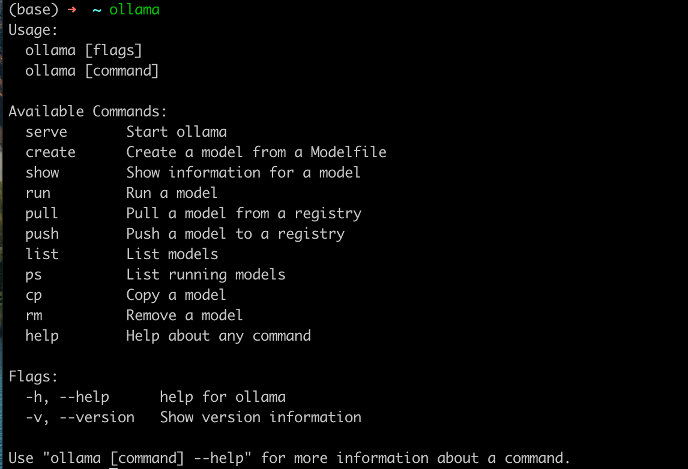
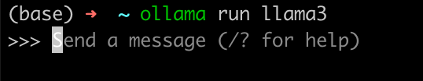

最近大模型很火，有一些公司会尝试自己购入一些显卡，然后部署开源大模型到本地/购买openai的API进行二次开发，用于自己内部使用或嵌入某一些应用中去解决一些业务问题。而定制化开发的时候，大家大概率会使用到一个叫做langchain的第三方包，因为感觉这个三方包其实还是有一点点小抽象，所以决定记录一下我对这个包的初步使用。


文章从自己想要实现的东西，一步步去解析langchain中的一些功能和设计理念。

# 本地部署一个大模型（llama3）
访问[https://ollama.com/](https://ollama.com/)下载Ollama客户端，下载Windows版本，如果你的电脑是MacOs,下载对应的版本即可。


下载安装以后，打开终端，输入ollama：


命令行和llama3模型聊天：

备注：这里如果是第一次运行这个命令，会触发下载llama3模型文件，4个G的大小。




# 调用llama3的API？
上面已经展示了直接用命令行和llama3聊天，这里我们尝试一下用python调用llama暴露的接口进行聊天

```python
import requests
import json

url = 'http://localhost:11434/api/generate'
payload = {
    "model": "llama3",
    "prompt": "中国的四大发明是哪四个?",
    "stream": False
}
headers = {'Content-Type': 'application/json'}

response = requests.post(url, data=json.dumps(payload), headers=headers)

if response.status_code == 200:
    print('Response:', response.json())
else:
    print('Failed to get a response:', response.status_code)
```


然后我们再对比一下使用langchain的代码：

```python
from langchain_community.llms.ollama import Ollama
llm = Ollama(model="llama3")
result = llm.invoke("中国的四大发明是哪四个？\n 1，要求全部使用中文回复 2，控制回答字数在 100 字以内。")

print(result)
```


首先langchain的代码简单一点，**但是也没有说简单特别多？好像不用langchain也行？**


先带着这个问题我们再往下走看看

# 自定义 prompt？
上面是简单的对话，而往往我们使用大模型，能不能最大程度发挥出来大模型的能力，要看我们的prompt写的怎么样，顺手提供一份参考资料：[Best practices for prompt engineering with the OpenAI API](https://help.openai.com/en/articles/6654000-best-practices-for-prompt-engineering-with-the-openai-api)


现在我们继续上面的代码进行调整：

原生的python代码：

```python
import requests
import json

url = 'http://localhost:11434/api/generate'
payload = {
    "model": "llama3",
    "prompt": "",
    "stream": False
}
headers = {'Content-Type': 'application/json'}

prompt = """
###
角色:你现在是一个精通中国历史的历史学家。 
要求:
1，只允许使用中文进行回答
2，回答不允许超过100字
text:{}"""
question = "中国的四大发明是什么？"

payload["prompt"] = prompt.format(question)

response = requests.post(url, data=json.dumps(payload), headers=headers)

if response.status_code == 200:
    print('Response:', response.json())
else:
    print('Failed to get a response:', response.status_code)

```


使用langchain的代码：

```python
from langchain_community.llms.ollama import Ollama
from langchain_core.output_parsers import StrOutputParser
from langchain_core.prompts import ChatPromptTemplate

prompt_history = """
###
角色:你现在是一个精通中国历史的历史学家。 
要求:
1，只允许使用中文进行回答
2，回答不允许超过100字
text:{input}"""
prompt = ChatPromptTemplate.from_template(prompt_history)
# 创建chain
prompt_chain = prompt | Ollama(model="llama3") | StrOutputParser()

# 调用chain
result = prompt_chain.invoke('中国的四大发明是什么？')
print()
```


到这里就会慢慢的发现下面的代码好像，lanchain开始引入一些属于它的关键的模块了，比如上面针对输入大模型之前的**字符串处理(prompt)，以及大模型输出结果的字符串处理(outputParser)**


又比如用prompt、llm、outputParser**构建的一个chain（链）实例**。

依次是：

1，prompt接收我们invoke的输入，填充到input这里

2，大模型接收prompt的输入，大模型进行计算

3，StrOutputParser 针对大模型返回的结果再次进行字符串处理


到这里我们其实就会发现，langchain已经开始抽象一些概念（prompt，outputparse，chain），以便于我们后面业务逻辑扩展，以及让整个大模型的调用链路更加清晰，便于维护。我们可以继续往下走，针对一些特定的需求继续了解langchain，比如我们往往希望和大模型聊天的时候，他可以记住上下文，所以让我们继续往下看看怎么实现

# 有记忆的大模型？
这里的实现就不再重复用原生的python去实现了，大家如果自己感兴趣可以自己尝试实现，这里直接看langchain代码实现：

```python
from langchain_core.messages import AIMessage, HumanMessage
from langchain_community.llms import Ollama

model = Ollama(model="llama3")

result = model.invoke(
    [
        HumanMessage(content="Hi! I'm Bob"),
        AIMessage(content="Hello Bob! How can I assist you today?"),
        HumanMessage(content="What's my name?"),
    ]
)
print(result)
```

这里应该有更加优雅的实现方案，但是 langchain 0.2 版本中这段「简短优雅的代码」我始终跑不起来....


实现了基本的

# 想要能够关联本地资料？(RAG)
需求：比如我们现在需要用大模型做**智能客服、**但是因为是通用大模型，他是确认特定的业务背景信息的。这个时候就可以利用检索增强生成（RAG）把信息检索技术和大模型结合起来，将检索出来的文档和提示词一起提供给大模型服务。

```python
from langchain_community.embeddings import OllamaEmbeddings
from langchain_community.llms.ollama import Ollama
from langchain_community.vectorstores import FAISS
from langchain_core.documents import Document
from langchain_core.output_parsers import StrOutputParser
from langchain_core.prompts import ChatPromptTemplate
from langchain_core.runnables import RunnablePassthrough
from langchain_text_splitters import RecursiveCharacterTextSplitter
from loguru import logger

def get_llm():
    return Ollama(model="llama3")


def get_retriever():
    """
    将上下文进行embedding后进行存储且转为一个检索器
    :return:
    """
    docs = [Document(page_content="不管谁来了，四大发明都是：高铁、支付宝、共享单车和网购")]
    splits = RecursiveCharacterTextSplitter().split_documents(docs)  # 文档分割
    vector_store = FAISS.from_documents(splits, OllamaEmbeddings(model="llama3"))  # 文档 embedding 后存储
    retriever = vector_store.as_retriever()  # 从向量存储到一个检索器
    return retriever


def rag_question():
    """
    基于本地的文本回复
    :return:
    """
    prompt = ChatPromptTemplate.from_template(
        '1，强制要求全部使用中文回复 2，控制回答字数在 100 字以内。\n 根据上下文：{context} \n 问题：{input}')

    chain = (
            {"context": get_retriever(), "input": RunnablePassthrough()}
            | prompt | get_llm() | StrOutputParser()
    )
    result = chain.invoke('四大发明是哪四个？')
    logger.debug(f"result:{result}")
    """
        output:
        根据上下文，可以确定四大发明为：高铁（铁路）、支付宝（支付宝）、共享单车（共享自行车）和网购（电商）。
    """

if __name__ == '__main__':
    rag_question()
```


以上就是了解 langchain 的时候涉及的一些关键知识点，包括部署模型、自定义 prompt、对话历史参与计算、检索增强生成（RAG）结合大模型。后面应该还会去了解和尝试一下 agent，大家可以关注一波。

