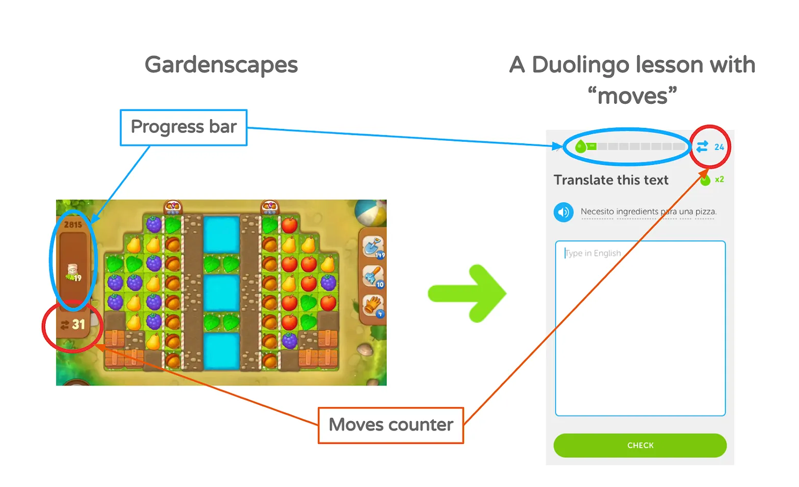

翻译原文一部分（大家也可以直接看原文）：[https://www.lennysnewsletter.com/p/how-duolingo-reignited-user-growth](https://www.lennysnewsletter.com/p/how-duolingo-reignited-user-growth)

# 借鉴Gardenscapes的游戏设计
大概是做了一个下图的一个借鉴：

多领国的团队做这个移植的目标是什么？ 

+ 提供用户的留存率

为什么移植游戏里面的功能而不是其他类型产品的？

+ 首先是因为多领国之前已经做成功了一些游戏化的功能（多领国的主页和成就等）
+ 其次是头部的数字游戏相比多领国有着高出许多的留存率。

为什么移植Gardenscapes游戏里面的这两个模块？

+ 三分钟的Duolingo课程感觉类似于Gardenscapes match-3级别，Duolingo和Gardenscapes都使用进度条提供用户完成课程的视觉反馈。然而，Gardenscapes将其进度条与移动计数器配对，而Duolingo原先没有这样做。
+ 同时多领国认为，移动计数器只允许用户完成一个关卡的有限数量的移动，这增加了游戏玩法的稀缺性和紧迫感。

结果怎样？

+ **对留存率和每日用户活跃数量都没有影响。**

****

# 借鉴 Uber 的推荐拉新
大概是做了下图的一个借鉴：

多领国的团队做这个移植的目标是什么？ 

+ 获取更多的新用户。

为什么选择参考 Uber 的推荐拉新逻辑？

+ 因为那个时候 Uber 的新用户增长很猛，而且据说主要是因为他的推荐拉新功能。

参考做了结果怎么样？

+ 新用户仅增长了3%。

# 开始总结失败经验了
事不过三，失败两次大的，开始总结失败经验倒很合理。

为什么我们借鉴的 Gardenscapes 的进度条失败呢？

因为当大家玩 Gardenscapes 的时候，每一次移动都像是做出了一次战略决策，因为你的这一次移动可能会影响你的下一次，从而影响到最后获取胜利。但完成多邻国课程并不需要做出战略决策，英语这个你要么知道，要不不知道，前后没有什么关联，也不需要什么战略，所以让多领国加上的计数器显得很无聊。同时也意识到了，这里借鉴的时候太多的关注在 Gardenscapes 和 Duolingo 的相似性上，但是忽略了他们的差异性。

为什么我们借鉴 Uber 的推荐拉新功能失败呢？

+ 奖励反馈的及时性：因为 Uber 拉新是可以免费乘车，每一次拉到用户，免费乘车的奖励就到了，然后你乘车立马就触发刺激反馈。而多领国这里大部分深度用户，也就是会去拉新的用户其实本身就是多领国的 VIP 用户了，就算拉新成功，也不能直接刺激到他们（不是从有到无，而是从有一段时间到拥有更长时间）
+ 目标用户的排他性：Duolingo的引荐计划设计上排除了最有可能参与的用户——即最活跃和忠诚的Super Duolingo订阅者。这部分用户正是品牌口碑传播的核心力量。

失败原因总结完了，当我们从其他产品借鉴想法的时候，要问自己

+ 为什么想要借鉴的功能在那个产品里面是能够正常工作的？
+ 为什么这个功能在我们的产品上中会成功或失败？
+ 如果想要这个功能在我们的产品上成功，需要做哪些调整？

