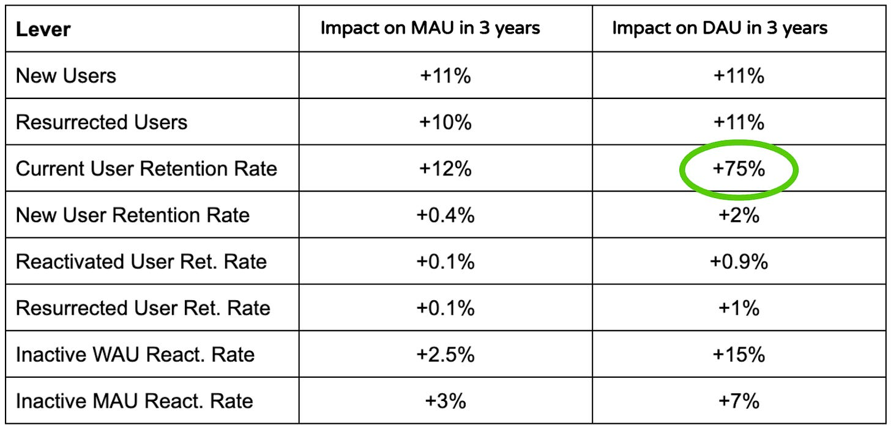

翻译原文一部分（大家也可以直接看原文）：[https://www.lennysnewsletter.com/p/how-duolingo-reignited-user-growth](https://www.lennysnewsletter.com/p/how-duolingo-reignited-user-growth)


# 模型的由来
多领国 一直有在收集数据，特别是用来支撑 A/B 测试，但是收集的这一些数据没有让我们产生一些特别的见解。然后就了解了一下 >Zynga 和 MyFitnessPal 是怎么 使用数据的。觉得多领国也需要找到一个北极星数据指标。


然后开始参考了 Zynga 做分层：


1. 当前用户留存率(CURR):  如果用户在过去两周中都访问过该产品，那么他们本周再次访问该产品的可能性
2. 新用户留存率(NURR):  如果用户上周是新用户，本周再次访问该产品的可能性
3. 重新激活用户留存率(RURR):  如果用户上周重新激活了游戏，那么他们本周再次返回游戏的可能性


又去 MyFinessPal 学习一波，发现他们除开上面三个，还有另外一个指标：

1. 复活用户留存率(SURR):  如果用户上周(从较长时间的缺席中)复活，那么他们本周返回的可能性

# 定制的数据模型
多领国开始基于上面的四个指标，然后再自己定制化了一波，实现了下面这张图的数据模型


**1，定义当日活跃用户分段**

+ New users:  第一天使用 APP 的用户。
+ Current users: 今天使用了 APP，并且往前 6 天内使用过 APP。
+ Reactivated users: 今天使用了 APP，并且上一次使用 APP 是前第 7 - 29 天使用过 APP。
+ Resurrected users: 今天使用了 App ，并且上次使用 App 是 30 天 之前了


**2，定义非活跃用户分段**

+ At-risk WAU: 今天不活动，但在过去6天至少有一天是活动的
    - At-risk WAU + DAU = WAU 
+ At-risk MAU: 在过去七天内处于非活动状态，但在之前的23天中至少有一天处于活动状态
    - At-risk MAU + WAU = MAU
+ Dormant users: 在过去31天或更长时间内没有活动
    - MAU + dormant users =  Total user base


这些块或桶代表了具有不同参与程度的不同用户群体。**每一个使用过该产品的用户在任何一天都只存在在其中一个桶里面**。这意味着模型中的bucket是MECE（互斥的，共同详尽的），各个块之间是互斥的、且所有块加起来就代表了曾经使用过Duolingo的整个用户群。


箭头代表着用户在bucket之间的移动（这些bucket包括CURR、NURR、RURR和SURR，但演变为每日保留率，而不是每周保留率）。该模型将水桶和箭头结合起来，创建了一个几乎封闭的系统，新用户是唯一的突破口。


这些桶（或称为用户群体）可以轻松地计算出每日活跃用户（DAU）、每周活跃用户（WAU）和每月活跃用户（MAU），这使得我们可以方便地对它们进行时间建模。这是模型的一个关键特性。此外，通过调整这些箭头所代表的比率，我们可以模拟这些比率随时间移动的复合和累积影响；换句话说，这些比率是产品团队可以操作的杠杆，用以增长DAU。

# 利用数据模型做计算
随着模型的创建，我们开始每天对数据进行快照，以创建所有这些用户桶和留存率在过去几年中每天的演变历史。有了这些数据，我们就可以创建一个前瞻性模型，然后进行敏感性分析，预测哪种杠杆对DAU增长的影响最大。我们对每种利率都进行了模拟，在三年的时间里，我们每季度移动一个2%的单一利率，同时保持所有其他利率不变。


下面是我们第一次模拟的结果。它显示了每个杠杆上2%的微小变动如何影响预测的MAU和DAU。



**有了这一个数据，大家就知道如果我们的目标是 DAU 的话，我们去提高 CURR、NURR、RURR、SURR 分别对于 DAU 的影响了。**

****

**上面是多领国的一个计算结果，我自己琢磨了一下，要是我有这个数据，我要怎么做计算？**

**第一个是 python 整一个简单版本的，用于理解：**

+ 通过历史数据，可以计算出来 **CURR、NURR、RURR、SURR **的一个平均值，用来做预测。
+ 然后基于 3 年前的一个基础数据，基于上面的平均值开始依次做计算，计算 12 个季度后的 CURR、NURR、RURR、SURR 和 DAU 的值。

```python
import pandas as pd
import numpy as np

# 步骤 1: 定义初始参数
initial_users = 100000
initial_rates = {
    'CURR': 0.50,  # Current Users retention rate
    'NURR': 0.20,  # New Users retention rate
    'RURR': 0.10,  # Reactivated Users retention rate
    'SURR': 0.05,  # Resurrected Users retention rate
}
rate_increase = 0.02  # Increase in retention rate per quarter
quarters = 12  # Number of quarters to simulate

# 步骤 2: 构建假历史数据
# 假设我们有一年的历史数据
dates = pd.date_range(start='2023-01-01', periods=365, freq='D')
historical_data = pd.DataFrame(index=dates, columns=['CURR', 'NURR', 'RURR', 'SURR'])
historical_data['CURR'] = np.random.normal(loc=initial_rates['CURR'], scale=0.05, size=len(dates))
historical_data['NURR'] = np.random.normal(loc=initial_rates['NURR'], scale=0.05, size=len(dates))
historical_data['RURR'] = np.random.normal(loc=initial_rates['RURR'], scale=0.05, size=len(dates))
historical_data['SURR'] = np.random.normal(loc=initial_rates['SURR'], scale=0.05, size=len(dates))

# 步骤 3: 模拟未来情景
# 初始化 DataFrame 存储结果
columns = ['Quarter', 'CURR', 'NURR', 'RURR', 'SURR', 'DAU', 'WAU', 'MAU']
df = pd.DataFrame(columns=columns)

# 初始化 DAU, WAU, MAU
dau = initial_users
wau = dau
mau = wau

# 模拟过程
for q in range(quarters):
    # 使用历史数据的平均值作为初始保留率
    curr_rate = historical_data['CURR'].mean()
    nurr_rate = historical_data['NURR'].mean()
    rurr_rate = historical_data['RURR'].mean()
    surr_rate = historical_data['SURR'].mean()

    # 模拟每季度的用户流动
    # 新用户
    new_users = int(initial_users * nurr_rate)

    # 当前用户
    curr_users = int(dau * curr_rate)

    # 重新激活用户
    rurr_users = int((wau - dau) * rurr_rate)

    # 复活用户
    surr_users = int((mau - wau) * surr_rate)

    # 更新 DAU
    dau = new_users + curr_users + rurr_users + surr_users

    # 更新 WAU
    wau = dau + (wau - dau)

    # 更新 MAU
    mau = wau + (mau - wau)

    # 更新 DataFrame
    df.loc[q] = [q, curr_rate, nurr_rate, rurr_rate, surr_rate, dau, wau, mau]

    # 调整 CURR 保留率
    curr_rate += rate_increase

# 输出结果
print(df)
```


第二种办法是用线性回归的模型

```python
import pandas as pd
from sklearn.model_selection import train_test_split
from sklearn.linear_model import LinearRegression
from sklearn.metrics import mean_squared_error

# 步骤 1: 加载数据
# 假设我们有一个CSV文件包含了历史数据
data = pd.read_csv('historical_data.csv')

# 步骤 2: 特征工程
# 特征：CURR, NURR, RURR, SURR, DAU
features = data[['CURR', 'NURR', 'RURR', 'SURR', 'DAU']]
# 目标变量：CURR, NURR, RURR, SURR (N天后的值)
target_variables = data[['CURR', 'NURR', 'RURR', 'SURR']].shift(-N_DAYS)  # 假设N_DAYS为预测天数

# 步骤 3: 划分数据集
X_train, X_test, y_train, y_test = train_test_split(features, target_variables, test_size=0.2, random_state=42)

# 步骤 4: 训练模型
model = LinearRegression()
model.fit(X_train, y_train)

# 步骤 5: 预测
predictions = model.predict(X_test)

# 步骤 6: 评估模型
mse = mean_squared_error(y_test, predictions)
print(f'Mean Squared Error: {mse}')

# 使用模型进行N天后的预测
N_DAYS = 30  # 假设我们要预测30天后的数据
last_known_data = features.iloc[-1:].values  # 最近一天的数据
future_prediction = model.predict(last_known_data)

# 输出预测结果
print("Predicted CURR, NURR, RURR, SURR after 30 days:")
print(future_prediction)
```


这里问了一下 AI，AI 说线性回归更好，因为可以利用历史数据中的复杂趋势，会有一个更加精确的预测模型来支持决策。

