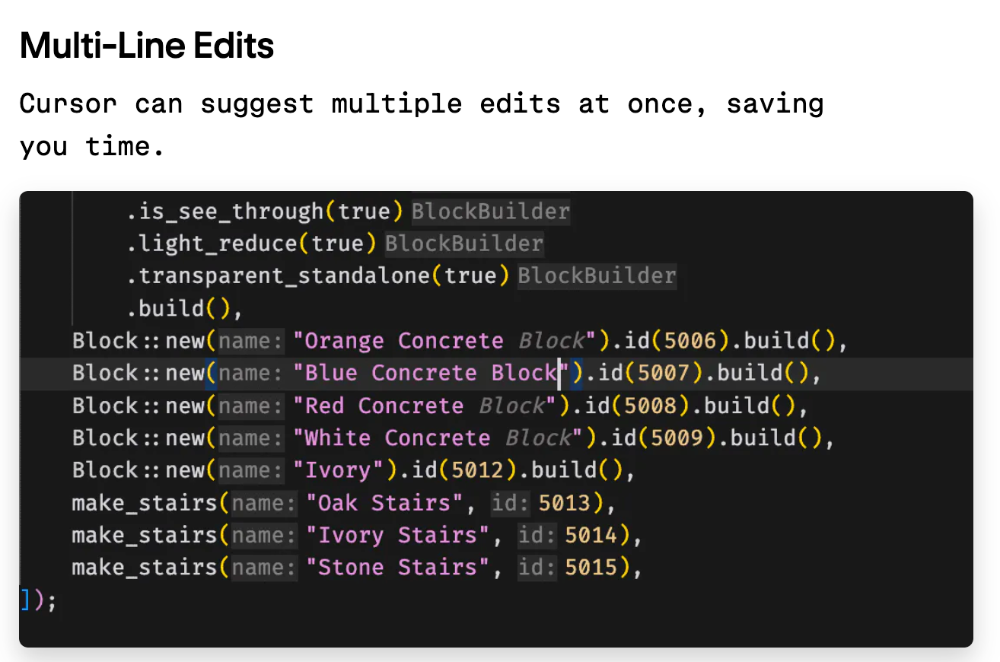
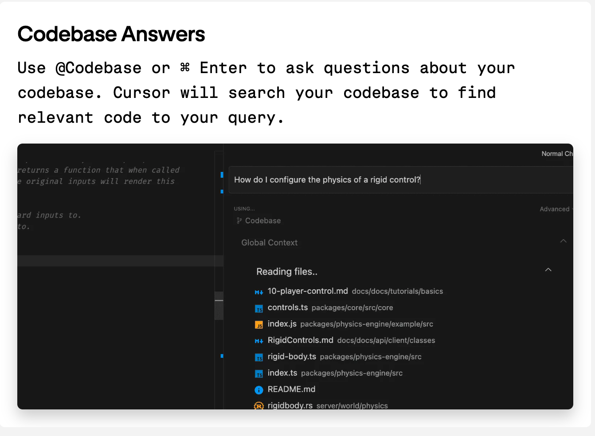

# 为啥要换?
## 修改现有多行代码
+ https://docs.cursor.com/tab/overview

> Powered by a custom model, Cursor Tab can:
>
> + Suggest edits around your cursor, not just insertions of additional code.
> + Modify multiple lines at once.
> + Make suggestions based on your recent changes and linter errors.
>

**如果用 Github Copilot**：他更多的是帮你直接生成代码，而不能说帮你修改当前的代码，或者说不能支持一次性修改多行。

**而现在用 Cursor**：ursor 会在你光标所在的代码那里，直接编辑附近的代码，他可以按一次tab，编辑多行代码，且他的提示会基于你最近的改动。

说一个场景，我平时写 golang ，对一个接口增加一个参数，可能需要改动调用点，实现点，以及更上层的调用点。

用 cursor 以后我只需要自己改动一次，然后按几次 tab

1，我只需要改动那个接口（**全程唯一自己的改动**）

2,  然后跳转到调用，按一下 tab,

3,  搜索一下原来的实现函数，切换到那里，按一下 tab，方法名和实现都会帮我改

4，最后假如你是写微服务有 application 层、domain 层，infrastructure 层，你会发现特别方便，你只需要改一个接口，三层都可以一下一下 tab自动修改，根本不需要怎么自己动手。

## 向量化本地代码
> For better and more accurate codebase answers using @codebase or Ctrl/⌘ Enter, you can index your codebase. Behind the scenes, Cursor computes embeddings for each file in your codebase, and will use these to improve the accuracy of your codebase answers.
>

简单来说就是把本地代码进行向量化，这样提示的时候，可以先将需要提示那块代码在本地做一下向量化搜索，然后一起发送给大模型，再给出结果。

**如果用 GitHub copilot**：我需要知道我这个改动可能关联项目中的哪一个代码文件（**不然AI 可能不能理解具体业务概念**），然后我去把那一个文件添加到上下文。要是那个文件很大，可能上下文过长，回复还会变慢。

**而使用 Cursor**：他这里自动融入到代码提示，不需要你手动的去添加某一个文件作为上下文，这样会大幅度提升代码提示的准确性，或者说这样的提示已经添加了你们业务的上下文，解决了有一些自己的业务概念AI 没办法理解的问题。

以上就是我感觉用 Cursor 以后提升最大的两个点。

# 其他一些好用的功能
## 可以直接创建文件
命令是cmd + shift + i

我说一个我使用的场景，我现在需要写一个定时任务脚本，脚本分为两个文件，一个文件负责数据库操作db_data.go, 一个负责主体逻辑 job.go

**如果使用 GitHub copilot：**

1. 我描述完需求以后，同时在需求中给copliot讲明白一些业务概念。
2. 创建两个文件然后复制他生成的两块代码，粘贴进去
3. 然后调试，然后一点一点改，一点一点 apply。

**现在用 Cursor：**

1. 快捷键直接直接打开一个面板，然后你描述你的需求，告诉他业务概念直接检索本地的 codebase。
2. 然后他会直接创建对应的文件和文件夹
3. 然后你可以开始 debug，debug 有问题直接描述，然后 apply 自动替换。而且这个时候你也可以结合 「向量化本地代码」这样你的描述里面的业务概念，他也可以理解。

两个最大的变化就是，首先是cursor 不需要详细的描述业务概念他会直接检索本地的 codebase，其次是 cursor 可以直接创建文件，同时后面的聊天会基于这个生成的文件内容进行调整，而不用刻意去艾特某个文件。

最后，cursor 其实还有一些比如「@一个链接，然后提问」、「直接引用本地的文档」、但这些我目前用的比较少，**主要感觉好用还是因为上面三个功能，可以直接一次性修改当前多行代码、本地代码支持向量化搜索提供给 AI、可以直接对话创建文件调试很方便**。

但最后也补一刀，就是 cursor 基于 vscode，这用习惯了JB家的IDE，换过来用 vscode 还真是有一点不习惯......但奈何cursor 的代码提示真的太 nice 了，vscode 也能忍...

