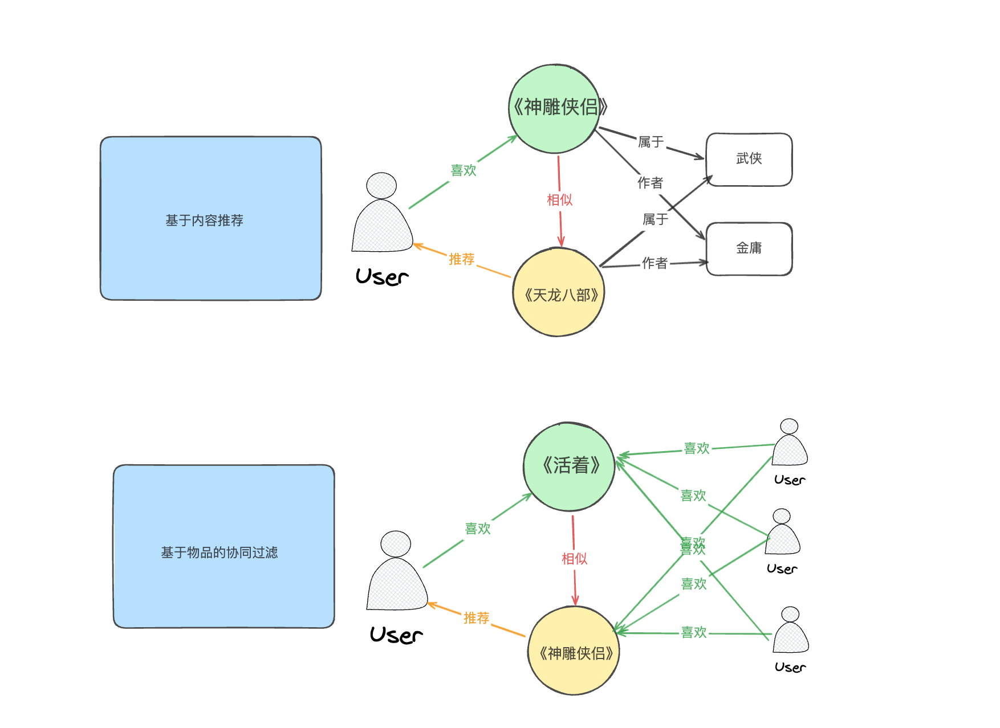
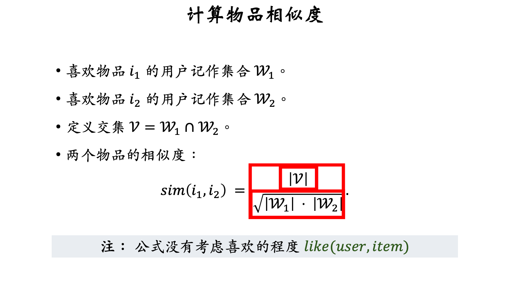
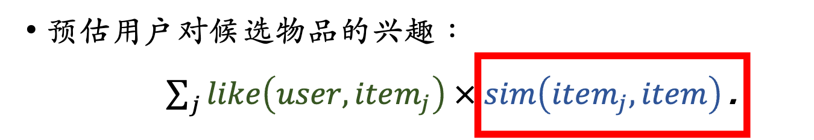

# 什么是「基于物品的协同过滤」？
「**基于物品的协同过滤」的本质是：如果用户喜欢物品A，而物品 A 和 物品 B 相似，那么我们推测用户可能也喜欢物品 B。**

咋一看是不是有点像「基于内容推荐」算法？逻辑上来说，推荐用户喜欢物品的相似物品这里的逻辑是一样的，但是「基于内容推荐」和「物品协同过滤」对于物品相似度计算不一样，比如：


内容推荐算法相似度：**数据源物品本身的内容性质**，特点是关注内容和物品特征，比如两本书中的作者、所属类型等等。可以参考另外一篇文章：
物品的协同过滤相似度：**数据源是基于用户的交互历史**，特点是关注用户行为和用户共同喜好是，比如《活着》和《神雕侠侣》两本书同时被3人一起阅读过所以他们相似。**这里也解释了本文标题的问题，好像给我推荐的内容和我原先喜欢的内容没有内容上的关联性。**

所以这样的相似度计算，就会让我有时疑惑🤔️，唉好像推荐给我的东西并没有跟我之前点赞过的东西有直接关联啊？那么具体到应用中，物品协同过滤中物品间的相似度如何量化呢？
# 物品协同中物品间相似度怎么计算？
## 简单的计算物品之间的相似度
简单的从喜欢和不喜欢的角度可以这样进行物品相似度的计算


简单的说这个公式想要表达的就是
1. 分子表达了两件物品同时喜欢的人越多则他们越相似
2. 分母表达了两件物品同时被人喜欢的时候，如果两件物品越是冷门（喜欢的人少）则他们相似度越高，越是热门（喜欢的人多），则他们的相似度越低。

上面是简单的针对物品喜欢和不喜欢维度，来做物品的相似度计算，但是我们往往喜欢和不喜欢会有一个程度，比如豆瓣的评分机制、淘宝的评分机制，接下来我们就将用户对于物品的评分引入到相似度计算
## 考虑用户喜欢程度的物品相似度计算


$sim(i_1, i_2) = \frac{\sum_{v \in V} like(v, i_1) like(v, i_2)}{\sqrt{\sum_{u_1 \in w1} like^2(u, i_1)} \sqrt{\sum_{u_2 \in w_2} like^2(v, i_2)}}$
举例假设有三位用户，他们对两部电影的评分如下:

- 用户 (A): 电影 (i_1 = 4), 电影 (i_2 = 5)
- 用户 (B): 电影 (i_1 = 3), 电影 (i_2 = 2)
- 用户 (C): 电影 (i_1 = 5), 电影 (i_2 = 3

此时,

- 分子:$(4\cdot5 + 3\cdot2 + 5\cdot3 = 20 + 6 + 15 = 41)$
- 分母: 
   - $(i_1): (\sqrt{4^2 + 3^2 + 5^2} = \sqrt{16 + 9 + 25} = \sqrt{50})$
   - $(i_2): (\sqrt{5^2 + 2^2 + 3^2} = \sqrt{25 + 4 + 9} = \sqrt{38})$
- 相似度$(sim(i_1, i_2) = \frac{41}{\sqrt{50} \cdot \sqrt{38}} \approx \frac{41}{43.58} \approx 0.9402)$

或者在python代码中，可以尝试用pandas构建一个pandas矩阵后，直接计算余弦相似度：
```python
import pandas as pd
from sklearn.metrics.pairwise import cosine_similarity

# 创建DataFrame
data = {'用户': ['A', 'B', 'C'],
        '电影i_1': [4, 3, 5],
        '电影i_2': [5, 2, 3]}
df = pd.DataFrame(data)
df.set_index('用户', inplace=True)
print(f"评分矩阵:\n{df}")

# 计算相似度
similarity_matrix = cosine_similarity(df.T)
print(f"\n相似度矩阵:\n{similarity_matrix}")
"""
相似度矩阵:
[[1.         0.94060451]
 [0.94060451 1.        ]]
"""
```

我们上面说完了物品之间相似度的计算，但是我们还要考虑的是物品他们之间的顺序，比如用户喜欢A和B，A和B都有10个相似的物品，那么这20个相似的物品该按照什么样的顺序推送给用户呢？
# 预估用户对物品的兴趣
**用户对物品的兴趣程度 = 用户喜欢A物品的程度 * 其他物品与A相似的程度**
**具体公式如下：**


- like(user,item_j) ： 这是用户对于喜欢的物品j的评分
- sim(item_j,item)： 这是和物品j相似物品的相似度

也就是基于上面所述，我们最终一个完整的基于物品的协同过滤算法步骤应该是：
1. 获取交互数据：我们首先获取所有参加运算的用户，以及每个用户对于每个物品的评价。
2. 计算物品相似度：基于第一步的数据可以计算出来一个N*N的矩阵，行和列分别是物品ID，矩阵中每一个点分别是行和列对应的相似度。
3. 计算用户推荐物品列表：基于第一步的数据，获取用户所有交互过的物品的评价 * 此物品的相似物品的相似度（第二步中的结果）
4. 推荐结果：最后构建出来一个推荐结果，N行，每行第一列是用户ID，后面N列是待推荐的物品的ID。
# 有哪些适用场景？存在哪些问题？
### 基于物品的协同过滤的适用场景和问题
#### 适用场景：

1.  **物品数量相对稳定，但用户数量持续增长的情况**：因为重点是分析物品间的相似性，所以适用于物品相对固定或较少而用户数量不断增加的环境。
2.  **特定物品交互数据丰富的平台**：例如电影推荐系统，用户对电影的评分和观看行为可以为算法提供充足的数据，使其能够准确计算出物品之间的相似性，并进行有效推荐。 
#### 存在的问题：

-  **稳定性问题**：物品之间的相似性一旦计算完成，难以反映出新兴趋势或用户偏好的变化。除非重新进行大规模的相似度更新，否则推荐系统的灵活性和即时反应能力较低。 
-  **物品新颖性问题**：由于算法倾向于推荐与用户历史偏好类似的物品，可能导致推荐内容的多样性和新颖性不足，用户难以接触到全新的物品类别。 
-  **冷启动问题（新物品）**：对于新加入系统的物品，由于缺乏足够的用户交互数据，难以快速计算出其与其他物品的相似性，从而影响这些新物品的推荐效果。 

以上，最后再描述一下基于物品的协同过滤算法的逻辑是推荐物品给那些**与目标用户具有相似偏好的用户喜欢的物品**。这个算法核心是**找出那些有着相似历史交互行为的用户**，认为这些用户在其他未知物品上的喜好也会有类似之处。

