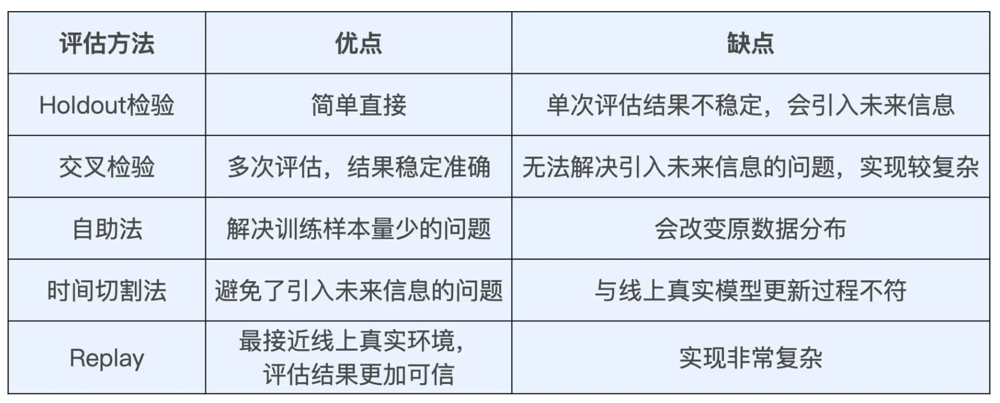
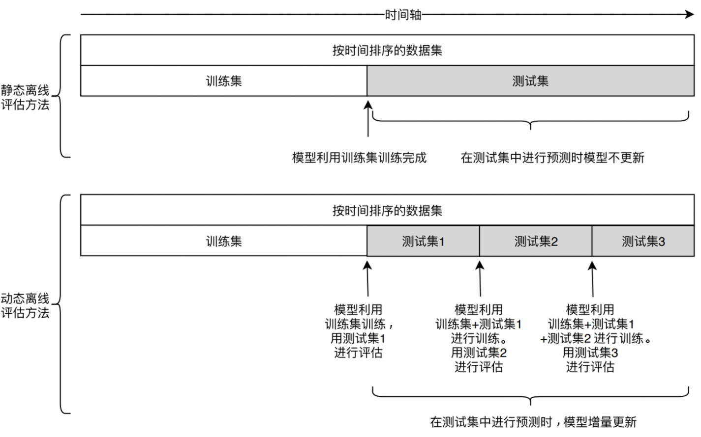

# 为什么需要进行离线评测？
**风险控制**：通过离线评测的结果，可以提前在不影响线上服务的情况下，知道这次的算法或者代码改动是否导致了 bug。
**加快迭代速度**：通过离线评估，可以快速排除效果不佳的模型，减少不必要的在线测试。
**可以覆盖多种情况**：在线毕竟有一部分用户可能测试不到，但是如果离线可以用所有的历史数据，则计算出来的指标更加全面。

至于离线评测的指标，大家可以参考上一篇文章。
# 怎么做离线评测？
查找了一下网上的信息，离线评测的方法有以下几种，各有优缺点

参考链接：[https://bbs.huaweicloud.com/blogs/328524](https://bbs.huaweicloud.com/blogs/328524)

这里采用最简单的静态时间切割法：

- 拿我们之前举过的豆瓣的例子，假设时间分割点为 1 个月
- 训练集 = 用户 ID、用户一个月前加入的小组
- 测试集 = 用户 ID、用户最近一个月加入的小组

我们用训练集做数据训练，然后看推荐结果和测试集合的重合度。
# 分离计算和离线评测
开始我直接在生成「内容推荐脚本」中做了一些调整，让其兼容离线评测的逻辑（**比如通过注入参数，读取特定的数据（训练集数据），推荐结果生成的时候需要过滤掉自己已经加入的星球，这里也需要通过参数控制**），第一次调整很快，但是这里违反了**「单一职责原则」、「高内聚低耦合」从而导致「推荐算法脚本」本身的复杂度上升，维护起来颇为困难。**

后续改动则是「内容推荐脚本」本身不作任何改动，单独维护一个离线评测脚本，其中包含三个模块。

1，离线数据构造模块：离线训练集和测试集生成。
2，hook 模块：不该变「内容推荐脚本」的代码，在另外一个脚本调用他，然后进行 hook。一方面让其读取训练集的数据，一方面对于一些实时过滤的规则进行重写让其符合训练集以及测试集的特征。后续如果有需要 hook 的地方，也只需要关心这个模块就好了。
3，指标计算模块：最后根据第二步计算出来的结果，计算我们需要的数据指标

- 推荐质量和准确度：整体推荐的星球个数、recall、precision、f1-score
- 覆盖度：推荐覆盖用户数量

以上，这样重构以后，**就避免了我们的离线评测代码侵入到我们推荐算法的逻辑中去，实现了解耦，然后本身离线评测脚本，也分成了几个模块，维护起来就比较方便了。**
 

