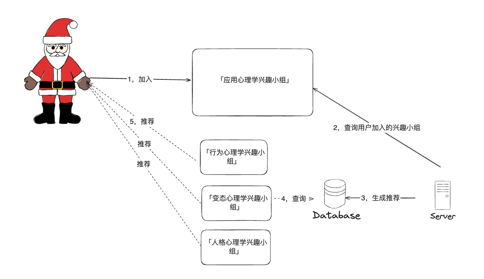

# 为什么app推荐的都是我喜欢的内容？

因为有一些APP的推荐算法是内容推荐算法，而内容推荐算法的逻辑就是：
比如你在豆瓣上说你看过《庆余年》，第二天豆瓣给你推荐了《琅琊榜》
比如你在京东买了《Python 编程 从入门到实践》，第二天京东给你推荐了《深度学习入门》
比如你在B站点赞了战鹰的视频，第二天B站给你推荐励志、学习的视频，那一定是 B 站算法抽风了，按道理应该给你推搞笑、抽象的视频

综上所述，庆余年对应琅琊榜（他们都是古装），Python 对应深度学习（深度学习用 Python 的多）、战鹰对应搞笑和抽象（这就不用解释了吧）

**总结就是推荐的内容，都是和用户行为（看过，买过，点赞）作用过的对象（举例：庆余年）有着相似内容的其他对象（举例：琅琊榜）。**

# 基于内容推荐的推荐实例图解

需求背景：假设我们现在需要为豆瓣用户推荐「豆瓣里面的兴趣小组」，要求使用的推荐算法是基于内容推荐。

图解一下推荐过程：

在使用豆瓣 APP 的路径也就是：当一个用户加入「应用心理学兴趣小组」后，推荐服务会基于这个基础数据进行计算，计算出来和「应用心理学兴趣小组」内容相似的小组有「行为心理学兴趣小组」、「变态心理学兴趣小组」、「人格心理学兴趣小组」，然后存储到数据库，最后推荐给用户。

这里的关键就是，我们怎么知道「应用心理学兴趣小组」内容相似的小组有「行为心理学兴趣小组」、「变态心理学兴趣小组」、「人格心理学兴趣小组」呢？而不是「拉丁舞兴趣小组」、「哲学兴趣小组」？

有人说，我们看小组名字就可以知道他们相似啊？他们都是心理学相关的

但这里有两个问题
1，看小组名就知道相关，这是从人的角度，但计算机怎么知道通过两个小组名知道他们相关呢？
2，兴趣小组的名字能够代表笑啥吗？小组名挂羊头卖狗肉怎么办？比如说是应用心理学，其实可能更多的是这个方向考研的小组呢？

好了，接下来带着这两个问题我们进入下面这一部分，我们写一点简单的 Python demo 代码来解答上面的两个问题。
# python实现豆瓣兴趣小组推荐

## 解决文本相似度

如何通过两个小组的小组名字来判断他们两个小组相似呢？有一个答案是向量

我们可以分成几步走：
1，先加载一个词向量的模型
2，把小组名字，用 jieba 这个包进行分词
3，针对第二步得到的分词结果，丢到模型中进行相似度计算，得到两个小组名之间的相似度
```python
import jieba
from gensim.models import KeyedVectors
from loguru import logger


def load_word_vectors(file_path):
    word2vec_model = KeyedVectors.load_word2vec_format(file_path, binary=False)
    return word2vec_model


def calculate_similarity(word2vec_model, group_name1, group_name2):
    # Step 2: 分词
    words1 = jieba.lcut(group_name1)
    words2 = jieba.lcut(group_name2)
    logger.info(f"words1: {words1}, words2: {words2}")

    # Step 3: 计算相似度
    similarity = word2vec_model.n_similarity(words1, words2)

    logger.info(f"group_name1: {group_name1}, group_name2: {group_name2}, similarity: {similarity}")
    return similarity


# 1，加载词向量模型
# https://github.com/cliuxinxin/TX-WORD2VEC-SMALL
word2vec_model = load_word_vectors('45000-small.txt')

group_name_similarity = calculate_similarity(word2vec_model, '行为心理学', '人格心理学')
print(f"小组名字相似度：{group_name_similarity}")  # 0.8431666493415833

group_name_similarity = calculate_similarity(word2vec_model, '行为心理学', '哲学')
print(f"小组名字相似度：{group_name_similarity}")  # 0.6714279651641846

```

上面可以看到对「行为心理学」和「人格心理学」词向量的相似度是 0.84，而和「哲学」的词向量相似度是 0.67，符合我们的预期，不过我们可以根据这个计算结果进行推荐了吗？

我理解是不行，有下面两个原因
1，因为我们不知道「人格心理学」兴趣小组里面是不是真的是人格心理学？**万一挂羊头卖狗肉呢？**
2，**兴趣小组名字长度有限，能够表达的信息也有限**，比如「人格心理学」小组中可能会把心理学的知识应用到职场会有一些职场知识，如果我们只看小组名， 那我们就错过了可以给加入了职场相关的兴趣的用户推荐「人格心理学」这个兴趣小组了。

## 解决小组名信息维度不够

为了解决小组名和实际内容不符以及小组名信息维度不够这两个问题，我们就可以考虑修改相似度计算的逻辑，将从原来的计算小组名之间的相似度，改为计算小组的相似度：

第一种方案：
  
具体流程：
1，我们从兴趣小组中抽取出来认为能做代表这个兴趣小组的帖子
2，我们通过 tf-idf 提取第一步抽取的帖子中的关键词
3，针对单个兴趣小组中所有的帖子的关键词进行合并，比如[key1,key2,key3]
4，对其他星球进行1-3 步操作，最后合并所有的小组关键词，构建一个 one-hot 编码的矩阵
5，根据 one-hot 的矩阵对所有兴趣小组相互计算相似度，取出各个兴趣小组排名前 10 的

第二种方案：
1，我们从兴趣小组中抽取出来认为能做代表这个兴趣小组的帖子
2，我们提取第一步抽取的帖子中的关键词，然后提取腾讯开源向量
3，单个兴趣小组中所有的帖子的向量进行计算，取一个平均值
4，对其他星球进行1-3 步操作，最后根据代表小组向量的值，进行相似度计算

对比一下这两种方案的优缺点：

第一种方案：优点：实现简单、可解释性强。缺点：TF_IDF对长文本处理不佳、但是可能没办法很好捕捉一些语义信息。
第二种方案：优点：有考虑到语义信息。缺点：计算量可能偏大。

这里采用第一种简单的方案尝试进行实现，Python 代码如下（大家可以根据自己的业务情况决定采用第一种还是第二种方案）:
```python
import jieba.analyse
import pandas as pd
from loguru import logger
from sklearn.metrics.pairwise import cosine_similarity


# 获取训练数据
def get_train_data():
    data_dict = {
        'Group1': ["爱好摄影的朋友来交流", "分享今天的摄影作品", "如何拍出好的风景照"],
        'Group2': ["关于Python编程的讨论", "学习Python的好资源", "Python项目实践经验"],
        'Group3': ["周末登山活动记录", "户外运动装备推荐", "如何选择适合的登山路线"],
        'Group4': ["烹饪技巧分享", "家常菜谱大全", "如何做好一桌子饭菜"],
        'Group5': ["历史书籍推荐", "历史事件讨论", "如何理解历史的发展"]
    }

    # 利用字典和列表推导式转换数据为长格式列表
    long_format_data = [(group, post) for group, posts in data_dict.items() for post in posts]

    # 创建DataFrame
    return pd.DataFrame(long_format_data, columns=['Group', 'Post'])


# 提取关键词
def extract_keywords(posts):
    return set(jieba.analyse.extract_tags(posts, topK=5))


# 构建One-Hot编码矩阵
def generate_one_hot(df, all_keywords):
    def encode(post_keywords):
        return [1 if keyword in post_keywords else 0 for keyword in all_keywords]

    keyword_sets = df['Keywords'].apply(encode)  # return a Series
    ret_df = pd.DataFrame(list(keyword_sets.values), index=df.index, columns=all_keywords)
    return ret_df


def get_group_one_hot(df):
    df['Keywords'] = df['Post'].apply(extract_keywords)
    # 创建关键词集合的唯一列表
    all_keywords = list(set().union(*df['Keywords']))
    logger.info(f"All keywords: {all_keywords}")
    # 构建One-Hot编码矩阵
    one_hot_matrix = generate_one_hot(df, all_keywords)
    # 聚合每组的One-Hot编码
    group_one_hot = one_hot_matrix.groupby(df['Group']).sum()  # 这里用的 sum 则关键词出现次数会加权，用 max 则不会
    return group_one_hot


def get_top_similars(group_one_hot):
    # 计算相似度
    similarity_matrix = cosine_similarity(group_one_hot)
    similarity_df = pd.DataFrame(similarity_matrix, index=group_one_hot.index, columns=group_one_hot.index)
    # 获取每组的最相似的前10个组
    top_similars = similarity_df.apply(lambda x: x.nlargest(2).index.tolist(), axis=1)
    return top_similars


def run():
    df = get_train_data()
    group_one_hot = get_group_one_hot(df)
    top_similars = get_top_similars(group_one_hot)
    for group, similars in top_similars.items():
        logger.info(f"Top similar groups to {group}: {similars}")


if __name__ == '__main__':
    run()

```

# 有哪些适用场景？存在哪些问题？

**有哪些适用场景？**
1，适合在用户数据较少或难以获取其他用户的交互数据情况下使用。特别是在新用户（冷启动问题）、新产品推出时，这种推荐算法能有效工作，因为它依赖于用户之前的选择和产品的特征描述，而不是依赖用户与其他用户之间的相互行为。
2，业务场景和内容强相关的，比如新闻推送（相同主题的新闻）、书籍推荐、电影电视（电影类型、主题、演员、导演）

**存在哪些问题 ？**
过度特化： 推荐系统可能会过度倾向于推荐非常类似的内容，导致推荐的多样性和新颖性不足。
限于已知特征： 如果系统未能捕获到足够全面或准确的内容特征，推荐的效果可能不佳。
维护与更新： 随着内容变化，**特征的维护和更新可能需要较大的人工投入。**


以上再总结内容推荐算法本质就是，**推荐和用户行为（看过，买过，点赞）作用过的物品（举例：庆余年）有着相似内容的其他物品（举例：琅琊榜）**。当然上面是一个 demo 所以可以很快实现，但是落地到具体业务，业务限制多了起来，那么我们的代码就会逐渐复杂数据量大起来，性能问题也会随之而来比如内存溢出。这篇再写就太长了，这块留到后面专门写一篇关于工程化的文章来做做记录。

