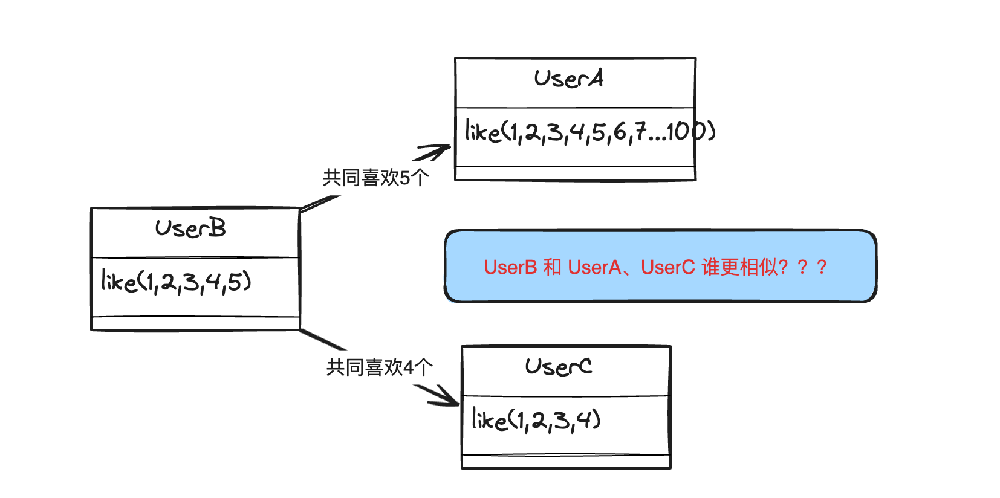
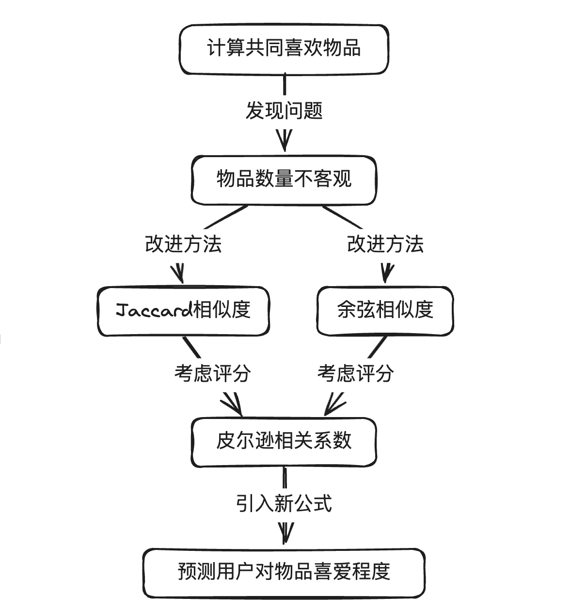

# 我有个朋友也喜欢这个推荐？
为什么我们有时候会出现我有一个朋友也喜欢这个推荐的感觉？那是因为有一个常见的推荐算法「基于用户协同过滤」是基于下面图片的一个假设：**当小明和小红都喜欢物品A、B的时候，如果小明还喜欢C，那么大概率小红也会喜欢物品C，总结成四个字就是「人以群分」**。


不过这里也带来了一个问题就是，假如我是小红，而小明、小黑、小蓝都有数量一样的我喜欢着的物品，那么这个时候推荐系统应该推荐「小明、小黑、小蓝」这三个人喜欢的其他物品？换句话说我们怎么量化用户和用户之间的相似度呢？
# 如何量化用户之间的相似度？
最简单的就是，我们直接用用户**共同喜欢的物品数量作为两个用户的相似度**？但这个时候会存在一个问题

例如

A和B的相似度：用户A可能喜欢100件物品，而用户B只喜欢5件物品，且这5件物品完全被A所包含。如果仅考虑共同喜欢的数量，∣A∩B∣为5
B和C的相似度：用户B可能喜欢5件物品，而用户C只喜欢4件物品，且这4件物品完全被A所包含。如果仅考虑共同喜欢的数量，∣A∩B∣为4

**如果用共同喜欢的物品数量，可以看到「A和B」要比「B和C」相似，但真实情况是尽管他们共同喜欢5件物品，但是B的喜好仅是A喜好的一个非常小的子集，因此二者的相似度被大大夸大**。为了解决这个问题我们引入jaccard相似度或者余弦相似度计算。
## 基础的相似度计算 
**Jaccard相似度**
Jaccard 中文名为杰卡德系数、杰卡德相似度，公式为：
$J(A, B) = \frac{|A \cap B|}{|A \cup B|}$

其中 A和 B 是两个用户喜欢物品的集合，$|A \cap B|$是集合 A 和 B 的交集元素的数量，$|A \cup B|$是集合 A 和 B 的并集元素的数量。

这里我们会将他们共同喜欢物品的数量，再去除以一个他们喜欢物品并集的数量，这样就可以避免其中某一个用户喜欢的物品数量很大，从而导致他和很多用户的相似度都很高。

**余弦相似度**
$\text{余弦相似度} = \frac{A \cdot B}{\|A\| \|B\|}$
假设现在有1-5本书，小明对于小红分别标记了喜欢（1）和不喜欢（0）

| 用户名 | 星际穿越 | 阿凡达 | 泰坦尼克号 | 教父 | 小丑 |
| --- | --- | --- | --- | --- | --- |
| 小明 | 1 | 0 | 1 | 1 | 0 |
| 小红 | 1 | 1 | 0 | 1 | 0 |

小明用A向量表示：[1,0,1,1,0]
小红用B向量表示：[1,1,0,1,0]

将上面两个变量带入到余弦相似度公式得到结果为：2/3，因为这里要考虑N个维度上的方向，所以如果遇到其中一个用户喜欢很多物品，而另外一个用户喜欢的物品很少的时候，这个相似度会降低，从而也可以避免我们之前遇到直接用「共同喜欢物品数量」不准确的问题。

不过这里可以发现，不管是余弦相似度还是jaccard公式进行计算出来的相似度，都是基于喜欢和不喜欢，而**没有考虑到用户对于一件物品喜欢的程度**，比如豆瓣中对于电影的评分1-5分，现在我们尝试改进我们的公式来解决这个问题
## 引入评分来进行推荐
余弦相似度
我们只需要把标记的喜欢和不喜欢换成对应的评分，然后用余弦相似度就可以,我用代码演示一下
```python
from scipy import spatial
user_1 = [1, 0, 1, 1]
user_2 = [1, 0, 1, 3]
user_3 = [1, 0, 1, 5]
cos_sim = 1 - spatial.distance.cosine(user_1, user_2)
print(f"user_1 and user_2 cos_sim:{cos_sim}") # user_1 and user_2 cos_sim:0.9258200997725514
cos_sim = 1 - spatial.distance.cosine(user_1, user_3)
print(f"user_1 and user_3 cos_sim:{cos_sim}") # user_1 and user_3 cos_sim:0.8432740427115678
```
可以看到因为三个用户的第四部电影的评分不一致，相比之下user_2比user_3的评分更加接近user_1，所以看到最后相似度计算出来的结果也是符合我们的预期。user_1和user_2的相似度是0.92，而user_1和user_3的相似度是0.84。

但这个时候也有一个问题就是，有一些用户就是喜欢打高分，有一些用户就是喜欢打低分，那我们怎么办？这个时候我们就可以使用皮尔逊相关系数，这里就直接考虑到了**用户评分偏好。**

## 用户评分偏好不一样怎么办？
皮尔逊相关系数衡量的是两个变量间线性相关程度的强弱，公式如下：
$sim(u, v) = \frac{\sum_{i \in I} (R_{u,i} - \bar{R}_u)(R_{v,i} - \bar{R}_v)}{\sqrt{\sum_{i \in I} (R_{u,i} - \bar{R}_u)^2} \sqrt{\sum_{i \in I} (R_{v,i} - \bar{R}_v)^2}}$
其中，${R}_{u,i}$ 表示用户 u对物品 i 的评分，$\bar{R}_u$ 是用户 u的平均评分，I是用户 u和 v 共同评分的物品集合。我们尝试用python实现一下对于皮尔逊相关系数的计算，用的数据和余弦相似度一致。
```python
import pandas as pd

# 创建一个数据框，包含三个用户的评分数据
data = {
    'user_1': [1, 0, 1, 1],
    'user_2': [1, 0, 1, 3],
    'user_3': [1, 0, 1, 5]
}
df = pd.DataFrame(data)

# 使用 pandas 中的 corr 函数计算皮尔逊相关系数
correlation_matrix = df.corr(method='pearson')

print("皮尔逊相关系数矩阵:")
print(correlation_matrix)

"""
皮尔逊相关系数矩阵:
          user_1    user_2    user_3
user_1  1.000000  0.662266  0.526152
user_2  0.662266  1.000000  0.985624
user_3  0.526152  0.985624  1.000000
"""
```

可以看到出来这里也是user_1和user_2的相关系数（0.66）>user_1和user_3的相关系数（0.52），和余弦相似度保持一致。而且这里还引入了用户的平均分，有助于抵消个体的评分习惯对相似度计算的影响。

但这里又还有一点点问题，对user_1来说user_2比user_3更相似，那么user_2喜欢的所有物品就都一定优先级要比user_3的更高吗？
## 不同用户之间物品怎么排序？
假如我们找到了用户A最相似的10个用户，10个用户每个用户取10个他们喜欢的物品，然后计算这100个物品推荐给用户A的优先级，可以参考下面的计算公式：

$S_i = \sum_{u_j \in U} (r_{u_j, i} \times sim_{A, u_j})$
其中U是最相似的10个用户的集合，$r_{u_j, i}$ 是用户 u_j 对物品  i 的评分，$sim_{A, u_j}$是用户A与 物品u_j 的皮尔逊相关系数。

尝试用python做一下实现，皮尔逊相关系数计算直接沿用上面的代码：
```python
import pandas as pd

# 创建一个数据框，包含三个用户的评分数据
data = {
    'user_1': [1, 0, 1, 1],
    'user_2': [1, 0, 1, 3],
    'user_3': [1, 0, 1, 5]
}
df = pd.DataFrame(data)

# 使用 pandas 中的 corr 函数计算皮尔逊相关系数
correlation_matrix = df.corr(method='pearson')

# 假设用户A是user_1，U是user_2和user_3

# 提取用户A与其它用户的相关系数
sim_A = correlation_matrix['user_1'].drop('user_1')
print(sim_A)
# 计算推荐物品的优先级分数
recommendation_scores = pd.Series([0]*len(df), index=df.index)

# 遍历每个物品
for item in df.index:
    score = 0
    # 遍历每个相似的用户
    for other_user in sim_A.index:
        # 取用户对物品的评分和用户A与该用户的相似度
        rating = df.loc[item, other_user]
        similarity = sim_A[other_user]
        # 计算加权评分并累加到推荐评分
        score += rating * similarity
    recommendation_scores[item] = score

# 输出推荐分数
print(recommendation_scores)
"""
0    1.188418
1    0.000000
2    1.188418
3    4.617560
dtype: float64
"""
```

这里可以看到，物品3的评分是最高的，因为这个物品在两个相似的用户中评分都高，所以他的评分会比较高。

**以上，总结一下我们第二段整个的一个逻辑链路如下图所示，同时我们了解整个逻辑链路以后我们再往后看看我们什么时候用这个算法？会有哪些问题？**

# 有哪些适用场景？存在哪些问题？
**有哪些使用场景？**
1，**用户数量不是特别多，但是物品数量非常多的情况**：因为算法依赖于用户间的相似性，通过查找和目标用户兴趣相似的其他用户的历史行为来推荐物品。因此，当系统中有足够多的物品产生足够的用户数据，能够确保算法能够找到相似用户时，使用这种方法是合适的。

2，**需要强调和利用用户间社交关系和行为模式的场景：**比如微信读书给你推荐某本书的时候会说「N位好友在读」、「N位好友读完」


**存在什么问题？**

- 扩展性问题：当用户基数非常大时，计算用户间的相似度会变得非常耗时和计算量巨大。
- 稀疏性问题：在用户-物品交互数据极为稀疏的情况下，难以找到相似的用户，从而影响推荐质量，**这也是说之前这个适合物品数量多的场景，因为物品多用户更加用户和更多的物品产生交互数据**。
- 冷启动问题：**新用户由于缺乏足够的交互数据**，难以为其找到相似的现有用户，使得推荐效果不理想。

知道了适用场景和存在的问题，就可以结合其他其他算法在合适的时候进行使用，比如面对冷启动问题，我们可以用之前说过的内容推荐算法（基于物品属性而不那么依赖物品交互，所以不用这么担心冷启动），又比如扩展性问题，我们可以用基于物品的协同过滤算法（因为往往物品数量远远少于用户数量）....


以上，最后再描述一下基于用户的协同过滤算法的逻辑，这个算法的**核心逻辑是推荐用户之前已交互过的物品的相似物品**（这与内容推荐相似，都依赖于物品的特征比较），同时算法确定物品相似度的基础是**用户的交互数据**，即通过分析哪些物品常被同一用户同时选择或评价来评估物品之间的相似性（这正体现了协同过滤方式，它通过群体的交互行为来提供个性化推荐）


