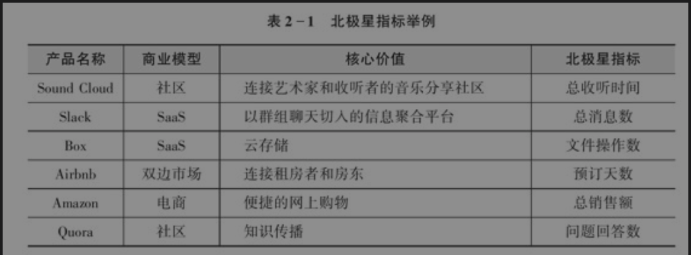

# 为什么需要整体的路线图？
> 因为要避免大家东一榔头、西一棒槌地瞎碰运气。绘而制一份目标明确、重点突出的增长作战计划书，然后在实战过程中，以这个计划书为蓝图问问题、提假设、做测试、得结论，步步为营，不断地调整和修正你的假设，揭示增长的问题和关键所在，最终达到目标。
>
> 
>
> 这张增长作战计划书上需要有以下几样东西：
>
> + 方向标：北极星指标
> + 路线图：增长模型
> + 仪表盘：关键指标看板（定量数据）
> + 参考书：用户心理决策地图（定性数据）
>

想想如果你是一个程序员，产品提出来的需求不满足上面的任何一个条件，那你会怎么想？产品又在拍脑袋？

但是如果产品提出的需求满足上面的路线图，那一方面我们知道产品不是拍脑袋提出来的需求，另外一方面如果发现产品的需求不满足上面的路线图，那就可以拒绝或者提出质疑，毕竟最好做的需求就是被干掉的需求。

# 北极星指标
## 为什么需要北极星指标
> 为什么需要北极星指标？
>
> 第一，北极星指标可以指引方向：当公司达到一定规模，如果没有一个明确、统一的数据指标指引，很容易出现不同的队伍劲儿不往一处使的情况。
>
> 第二，北极星指标可以帮助大家明确任务的优先级：做增长涉及公司运营的方方面面，没有统一指标的指引，可能会眉毛胡子一把抓，无法有效地集中火力、抓住重点。
>
> 第三，提高行动力：设定一个数据指标，能够大幅度提高行动力。如同YC联合创始人保罗·格雷厄姆（Paul Graham）所说：“一旦你选定了你的目标，你只有一件事情可以做，努力达到那个目标。”
>
> 第四：指导实验，监测进度：通过这个目标，你可以知道公司的现状，有针对性地上线各种增长实验，然后观察有无成效，如此反复。
>

我个人对于上面的理解就如下：

第一个方面是**专注做一件事效率更高**，比如大家可以试试下面这个小游戏

1，心里默念 1,2,3...... 一直到26，念完以后再从a念到z，看看花多久？

2，心里默念 1、a、2、b、3、c，看看花多久？

第二个**方面是如果没有北极星指标，那么我们就没办法定义需求优先级**，到时候往往做什么可能不是由数据决定，而是由提出需求的人的话语权决定。

## 怎么定义北极星指标？
> 标准1：你的产品的核心价值是什么？这个指标可以让你知道你的用户体验到了这种价值吗？
>
> 标准2：这个指标能够反映用户的活跃程度吗？
>
> 标准3：如果这个指标变好了，是不是能说明整个公司是在向好的方向发展？
>
> 标准4：这个指标是不是很容易被整个团队理解和交流呢？
>
> 标准5：这个指标是一个先导指标，还是一个滞后指标？
>
> 标准6：这个指标是不是一个可操作的指标？
>

一些例子：

# 增长模型
## 为什么需要增长模型？
假设我们的北极星指标是 DAU，然后我们有 3 个备选需求，分别影响 新用户数、周活跃用户、月活跃用户。

那么我们应该优先哪一个呢，我们怎么知道这 **新用户数、周活跃用户、月活跃用户** 这三个指标能够最大程度的影响 DAU？

而增长模型就可以解决这个问题。你可以对你的增长模型输入上面三个指标，然后输出是你的北极星指标，这样就知道了三个备选需求我们应当选哪个了。

## 增长模型怎么构建？
步骤是定义北极星指标、绘制用户旅途、构建增长模型，用一个听歌应用来举例说明：

> 对于一个听歌应用来说，如果其北极星指标是“总听歌时间”，那么一个访客需要经过如下步骤，才能到达“总听歌时间”的状态：
>
> 1）下载应用；
>
> 2）注册账户；
>
> 3）浏览歌曲；
>
> 4）首次听歌；
>
> 5）持续登录；
>
> 6）持续听歌。
>
> 
>
> 所谓绘制用户旅程，就是要记录一个用户从对产品一无所知到体验到产品核心价值要经历的步骤。经过这一步，你就找到了增长模型的骨架。
>
> 
>
> 给用户旅程的每一步找到一个相应的指标，比如每月应用下载量是多少、注册率是多少、首次听歌率是多少。如果目前没有这个数据，先做个大概估算，同时开始设置追踪来弥补这个漏斗。
>
> 
>
> 这些指标就是增长模型的“输入变量”。接下来，
>
> 把各个输入变量代入进去，并不断分解每个变量到不能分解为止。你的目标是揭示出所有对增长有影响的单个输入变量，并把数据记录下来。
>
> 1）听歌应用活跃用户=新增活跃用户+已有活跃用户=（下载量×注册率×首次浏览比例×首次听歌比例）+（已有用户数×持续登录比例×持续听歌比例）
>

以上，当我们有了各个变量的基准数据，在设计和优化增长杠杆、不断实验并改进的过程中，可以通过观察增长模型中各个指标的变化来检测进展。

回到听歌应用的例子，如果增长模型的具体数据如下，从初步的分析中可以看出老用户的表现不错，新用户的首次听歌比例看起来是问题所在：

听歌应用月活跃用户

=（每月下载量×注册率×首次浏览比例×首次听歌比例）+（已有用户数×每月持续登录比例×持续听歌比例）

=（10000×50%×90%×30%）+（200000×80%×95%）

上面的优先级排序思路比较简单，只要目测找到增长模型中的最大瓶颈就行。通过定量增长模型，我们甚至可以进行假设分析（What-if analysis），量化不同增长项目的长期影响。具体可以看本书图2.6相关。

# 仪表盘
## 为什么需要仪表盘？
想一下，加入你在开一架飞机，但是没有仪表盘？那你慌不慌？

其实产品也是一样，产品的观测指标也有很多，如果不能被直观的看到了，可能我们做了的错误的功能影响了某一些用户我们也不能及时得到反馈。而当我们真正发现这个错误的功能的时候，可能已经错过了最佳的挽回用户的时间。

## 怎么构建一个仪表盘？
> 构建一个关键行为漏斗可以让你迅速了解用户旅程中各个关键步骤的转化效率。
>
> 
>
> 当了解了这些关键步骤之后，增长团队逐渐需要监测更多的数据指标。如同飞行员需要一个仪表盘一样，增长团队也需要一个自己的增长仪表盘。在这个仪表盘上，需要显示以下指标：
>
> 1）北极星指标：数值及趋势。
>
> 2）增长模型关键指标：头部访客量、新用户激活率、老用户留存率、盈利情况等。
>
> 3）关键细分指标：比如与关键行为相关的指标、一些重要流程的漏斗分解等。
>
> 4）重要用户分组：按渠道分、按新老用户分、按产品平台分等。
>
> 举例来说，社交图片分享平台Pinterest的北极星指标是月活跃用户数，其增长模型如图2-7所示。
>
> 
>
> 相应的，Pinterest增长仪表盘有如下五个看板（见图2-8）：
>
> 1）看板一：月活跃用户；
>
> 2）看板二：新注册用户；
>
> 3）看板三：激活；
>
> 4）看板四：参与度；
>
> 5）看板五：流失用户唤回。
>
> 
>
> 其中每个看板都进行了进一步的指标细分，一共包含27个指标。这些指标有的是按照群组分类，比如月活跃用户的趋势图就是按照产品平台、性别、国家/地区来源进一步细分；有的是按时间维度细化，比如在新用户激活看板上，不光追踪注册后第二周返回平台的比例，同时还要追踪用户注册35天并仍然为周活跃用户的比例；也有的是按渠道分，比如在参与度看板中又包含不同类型的邮件和移动推送的发送数量、打开率和点击率。
>

我理解不同的公司可能业务情况不一样，但是大体情况可以参考上面的逻辑。

# 用户决策心理地图
## 为什么需要用户决策心理
> 在分析“冷冰冰”的数据的同时，要记住数据的另一面是无数用户的行为汇总结果。数据是死的，而用户的行为和心理是活的。我们只有深入了解用户心理学，才能有效地驱动增长。
>

我理解这里的意思是，我们可以用数据去做一些选择题，但是怎么找到这些选择题，怎么让这一些选择题有更多以及更加优秀的选项，那么需要我们了解用户决策的心理。

## 一个标准的用户决策心理地图
> 1. 访问：用户会不会注意到这个产品？
> 2. 转化：我要不要试试看？这个产品对我用什么好处？
> 3. 激活：一开始想：我要怎么使用这个产品？ 最后：我得到了我想要的吗？
> 4. 留存：我还记得这个产品吗？ 我为什么要继续使用这个产品？我该什么时候在什么场景下使用这个产品？ 我能继续发现新的价值吗？
> 5. 推荐：我要把这个产品介绍给别人吗？介绍给谁呢？ 他会喜欢吗？我有什么好处吗？
> 6. 变现：我愿意为它付钱吗？ 值得吗？有别的替代品吗？
>

这里我理解大部分业务都应该会有这个路径，但是具体到每一个步骤可能不同的业务可以有不同的处理办法。

以上就是一开始说到的「增长作战计划书」上需要有以下几样东西：

+ 方向标：北极星指标
+ 路线图：增长模型
+ 仪表盘：关键指标看板（定量数据）
+ 参考书：用户心理决策地图（定性数据）

「方向标/北极星指标」 给我们一个最终的目标，让大家向一个地方发力，「路线图/增长模型」 让我们在发力的时候，指引我们的细分方向，而「仪表盘/关键指标看板」让我们知道我们的每一次发力带来了什么效果，最后我们再通过  「参考书：用户心理决策地图」来决定我们在什么时间点，依据用户的什么心理来发力。

